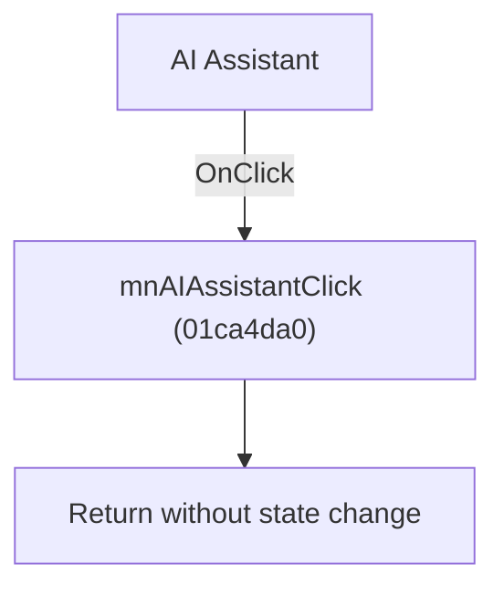

# AI Assistant

> Analysis status: Individually reviewed.

## Control

| Property | Recovered value |
| --- | --- |
| Form | SchematicEditor |
| Component path | SchematicEditor.MainMenu.mnTools.mnAIAssistant |
| Control class | TMenuItem |
| Caption | AI Assistant |
| Hint | Not present in the recovered resource. |
| Text | Not present in the recovered resource. |
| Handler name | mnAIAssistantClick |
| Handler address | 01ca4da0 |
| Graph node | `resource:dfm:SchematicEditor/SchematicEditor.MainMenu.mnTools.mnAIAssistant` |
| Handler node | `function:01ca4da0` |
| Graph layer | UI |

## What happens when clicked

The recovered handler clears a local empty UnicodeString and returns. It does not open an assistant or change application state. The menu and toolbar controls share this effective no-op.

## Click flow

## Handler evidence

- Source: [DecompiledSources/Tina16/functions/0000000001CA4DA0__FUN_01ca4da0.c](../../../DecompiledSources/Tina16/functions/0000000001CA4DA0__FUN_01ca4da0.c)
- Recovered role: No-op AI Assistant handler.
- Current graph summary: Handles 2 Delphi UI events: SchematicEditor.TopToolBar.EditorTools.sbAIAssistant.OnClick, SchematicEditor.MainMenu.mnTools.mnAIAssistant.OnClick.
- Current graph behavior: The recovered handler clears a local empty UnicodeString and returns. It does not open an assistant or change application state. The menu and toolbar controls share this effective no-op.
- Current graph evidence: FUN_01ca4da0 initializes a zero local string, calls the UnicodeString clear helper on it, and returns. It has no application-relevant outgoing call.
- Complexity: simple
- Distinct outgoing calls: 1

## Direct calls

- `function:00414480` — Delphi UnicodeString clear and finalization helper

## Resource evidence

- Kind: Not present in the recovered resource.
- Modal result: Not present in the recovered resource.
- Checked state: Not present in the recovered resource.
- List items: Not present in the recovered resource.
- Image reference: Not present in the recovered resource.
- Extracted glyph: None.

## Nearby label candidates

Nearby labels are layout candidates only. They are not proof of behavior.

- No same-parent label candidate is available.

## Analysis limits

- The resource does not explain why the command is inactive.

