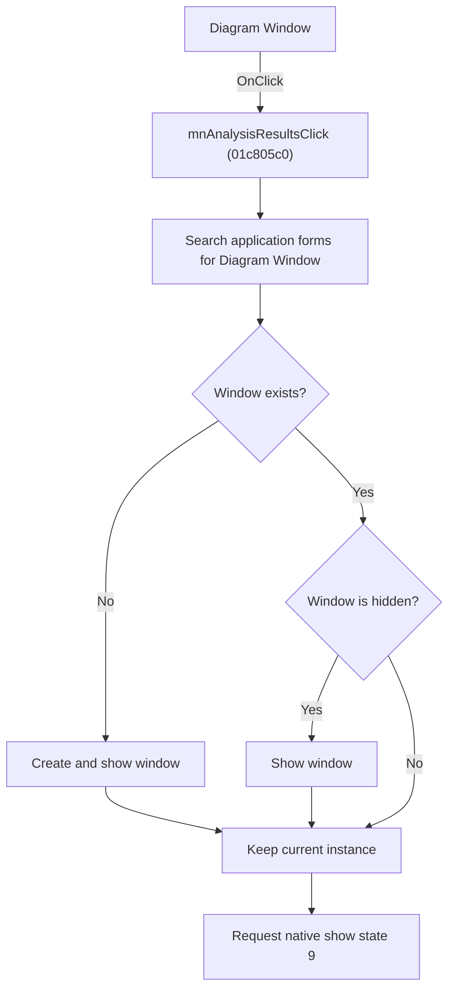

# &Diagram Window

> Analysis status: Source and call-path review complete.

## Control

| Property | Recovered value |
| --- | --- |
| Form | SchematicEditor |
| Component path | SchematicEditor.MainMenu.mnTools.mnAnalysisResults |
| Control class | TMenuItem |
| Caption | &Diagram Window |
| Hint | Not present in the recovered resource. |
| Text | Not present in the recovered resource. |
| Handler name | mnAnalysisResultsClick |
| Handler address | 01c805c0 |
| Graph node | `resource:dfm:SchematicEditor/SchematicEditor.MainMenu.mnTools.mnAnalysisResults` |
| Handler node | `function:01c805c0` |
| Graph layer | UI |

## What happens when clicked

The command opens the shared Diagram Window. The setup helper searches the application's open forms for the diagram-window class. It creates one only when no instance exists. It shows the form when it is hidden and updates the two shared diagram-window counters. The outer handler then obtains the native window handle and sends native show-state value `9`, which requests the existing window to return to its active display state.

The command does not calculate a new analysis. It opens or restores the window that displays analysis results.

## Click flow

## Handler evidence

- Source: [DecompiledSources/Tina16/functions/0000000001C805C0__FUN_01c805c0.c](../../../DecompiledSources/Tina16/functions/0000000001C805C0__FUN_01c805c0.c)
- Recovered role: Opens or restores the shared Diagram Window.
- Current graph summary: Ensures that one diagram-result window exists, shows it when necessary, and requests native show state `9`.
- Current graph behavior: Reuses an existing window instance. It does not start an analysis or replace the displayed result.
- Current graph evidence: `FUN_013d2e70` scans the application form list for class `PTR_FUN_01a69da8`, creates `PTR_DAT_02001e00` only when absent, tests its VCL visible byte, and shows it. `FUN_01c805c0` gets the native handle with `FUN_0065b870` and dispatches value `9`. The menu caption is `Diagram Window`.
- Complexity: moderate
- Distinct outgoing calls: 2

## Direct calls

- `function:0065b870` — FUN_0065b870
- `function:013d2e70` — FUN_013d2e70

## Resource evidence

- Kind: Not present in the recovered resource.
- Modal result: Not present in the recovered resource.
- Checked state: Not present in the recovered resource.
- List items: Not present in the recovered resource.
- Image reference: Not present in the recovered resource.
- Extracted glyph: None.

## Nearby label candidates

Nearby labels are layout candidates only. They are not proof of behavior.

- No same-parent label candidate is available.

## Analysis limits

- The imported native function name behind the recovered thunk is not present in the graph. The handle-plus-value-`9` call is explicit, but this article does not assign a Win32 API name to the thunk.
- The two shared counters changed by the setup helper do not have recovered Delphi names.

