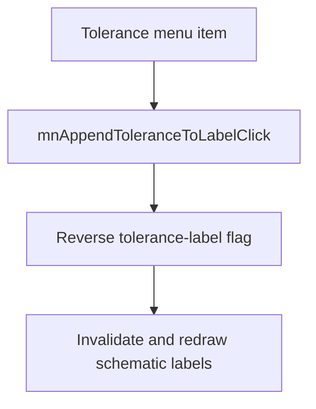

# Tolerance

> Analysis status: Reviewed with recovered display-state evidence.

## Control

| Property | Recovered value |
| --- | --- |
| Component path | `SchematicEditor.MainMenu.View.mnAppendToleranceToLabel` |
| Control class | `TMenuItem` |
| Handler | `mnAppendToleranceToLabelClick` at `01ca3a90` |

## What happens when clicked

The command reverses the global flag that controls whether component-label text includes tolerance data. It then invalidates the schematic view so that the labels are drawn again. The command does not change the value or unit flags.

## Click flow

## Evidence

- [Handler source](../../../DecompiledSources/Tina16/functions/0000000001CA3A90__FUN_01ca3a90.c) reverses `PTR_DAT_020037e8` and invalidates the schematic control.
- [Common macro-insertion path](../../../DecompiledSources/Tina16/functions/0000000001C6EC30__FUN_01c6ec30.c) also reads this flag together with the value and unit label flags when it transfers schematic content.

## Analysis limits

- The recovered global flag has no Delphi field name.
