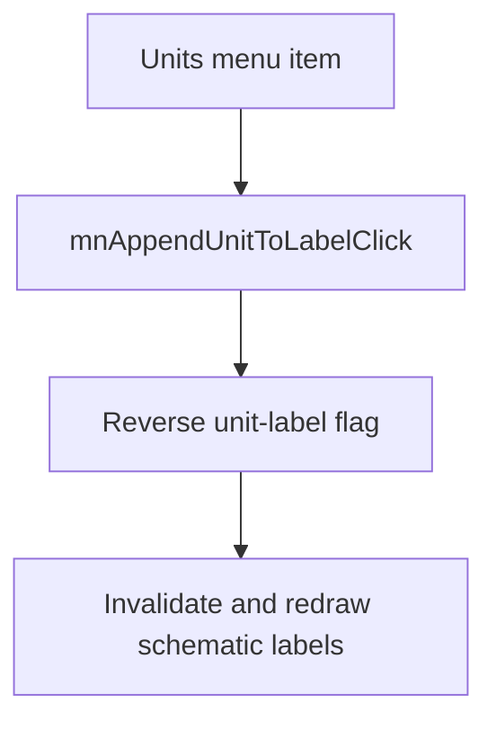

# &Units

> Analysis status: Reviewed with recovered display-state evidence.

## Control

| Property | Recovered value |
| --- | --- |
| Component path | `SchematicEditor.MainMenu.View.mnAppendUnitToLabel` |
| Control class | `TMenuItem` |
| Recovered checked state | `true` |
| Handler | `mnAppendUnitToLabelClick` at `01c98920` |

## What happens when clicked

The command reverses the global flag that controls whether component-label text includes units. It then invalidates the schematic view so that the labels are drawn again. This handler does not change the value or tolerance flags.

## Click flow

## Evidence

- [Handler source](../../../DecompiledSources/Tina16/functions/0000000001C98920__FUN_01c98920.c) reverses byte `0x815` in the shared label-state block and invalidates the schematic control.
- [Common macro-insertion path](../../../DecompiledSources/Tina16/functions/0000000001C6EC30__FUN_01c6ec30.c) reads byte `0x815` together with the value and tolerance label flags when it transfers schematic content.

## Analysis limits

- The recovered state block has no Delphi field name.
