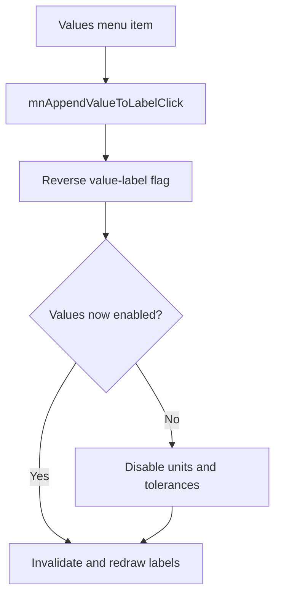

# &Values

> Analysis status: Reviewed with recovered display-state and dependent-flag evidence.

## Control

| Property | Recovered value |
| --- | --- |
| Component path | `SchematicEditor.MainMenu.View.mnAppendValueToLabel` |
| Control class | `TMenuItem` |
| Recovered checked state | `true` |
| Handler | `mnAppendValueToLabelClick` at `01c8e8b0` |

## What happens when clicked

The command reverses the global flag that controls whether component-label text includes values. When the click switches values off, the handler also switches units and tolerances off. When the click switches values on, it does not force either dependent flag on. The handler then invalidates the schematic view so that the labels are drawn again.

## Click flow

## Evidence

- [Handler source](../../../DecompiledSources/Tina16/functions/0000000001C8E8B0__FUN_01c8e8b0.c) reverses byte `0x814`, clears byte `0x815` and the tolerance flag only on the off transition, and invalidates the view.
- [Common macro-insertion path](../../../DecompiledSources/Tina16/functions/0000000001C6EC30__FUN_01c6ec30.c) reads all three label flags when it transfers schematic content.

## Analysis limits

- The recovered state block has no Delphi field name.
