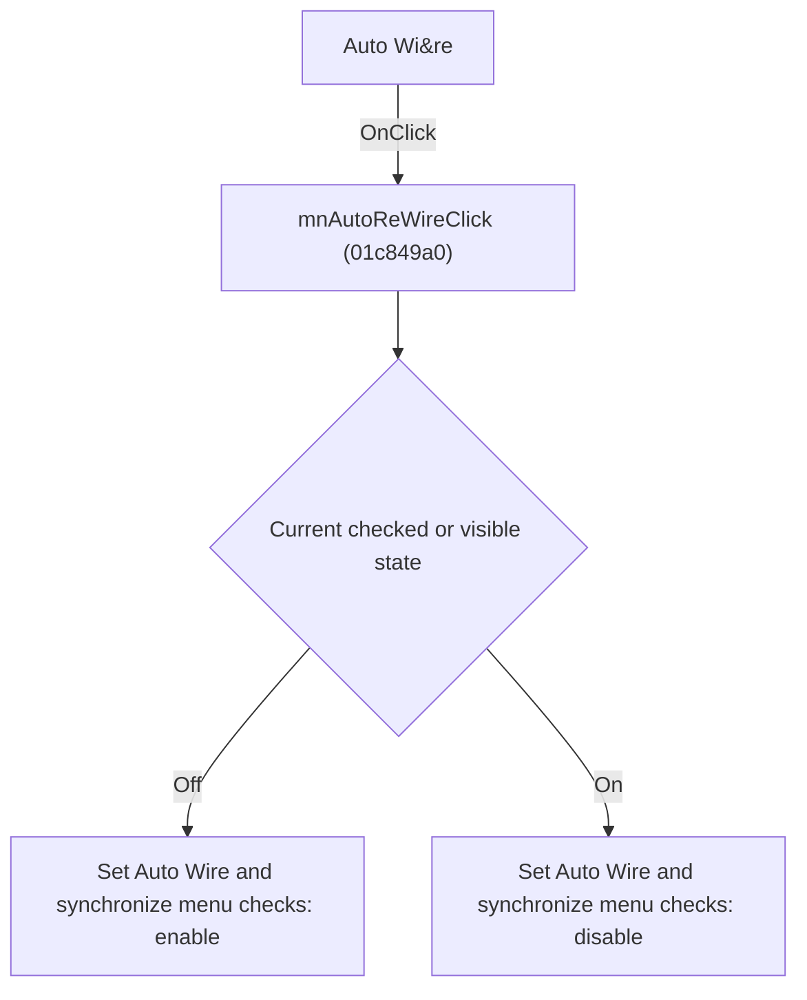

# Auto Wi&re

> Analysis status: Individually reviewed.

## Control

| Property | Recovered value |
| --- | --- |
| Form | SchematicEditor |
| Component path | SchematicEditor.MainMenu.Insert.mnAutoReWire |
| Control class | TMenuItem |
| Caption | Auto Wi&re |
| Hint | Not present in the recovered resource. |
| Text | Not present in the recovered resource. |
| Handler name | mnAutoReWireClick |
| Handler address | 01c849a0 |
| Graph node | `resource:dfm:SchematicEditor/SchematicEditor.MainMenu.Insert.mnAutoReWire` |
| Handler node | `function:01c849a0` |
| Graph layer | UI |

## What happens when clicked

The handler toggles the main menu item's checked state and copies the new value to the matching popup item. Sender is unused, so both controls change the same shared option.

## Click flow

## Handler evidence

- Source: [DecompiledSources/Tina16/functions/0000000001C849A0__FUN_01c849a0.c](../../../DecompiledSources/Tina16/functions/0000000001C849A0__FUN_01c849a0.c)
- Recovered role: Toggle automatic rewiring.
- Current graph summary: Handles 2 Delphi UI events: SchematicEditor.MainMenu.Insert.mnAutoReWire.OnClick, SchematicEditor.SchPopup.pmAutoReWire.OnClick.
- Current graph behavior: The handler toggles the main menu item's checked state and copies the new value to the matching popup item. Sender is unused, so both controls change the same shared option.
- Current graph evidence: The recovered body negates one menu checked byte and writes the value to both paired menu-item fields. Two DFM events resolve to the handler.
- Complexity: simple
- Distinct outgoing calls: 1

## Direct calls

- `function:007e2d20` — FUN_007e2d20

## Resource evidence

- Kind: Not present in the recovered resource.
- Modal result: Not present in the recovered resource.
- Checked state: true
- List items: Not present in the recovered resource.
- Image reference: Not present in the recovered resource.
- Extracted glyph: None.

## Nearby label candidates

Nearby labels are layout candidates only. They are not proof of behavior.

- No same-parent label candidate is available.

## Analysis limits

- The downstream rewiring consumer is outside this click path.

