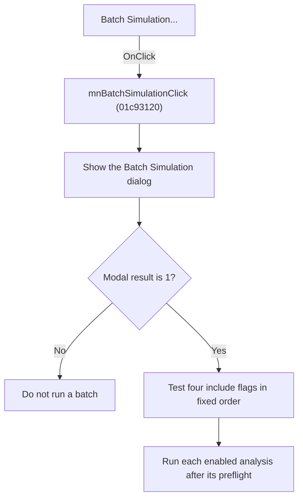

# Batch Simulation

> Analysis status: Reviewed from recovered source and graph evidence.

## Control

| Property | Recovered value |
| --- | --- |
| Form | SchematicEditor |
| Component path | SchematicEditor.MainMenu.mnAnalysis.mnBatchSimulation |
| Control class | TMenuItem |
| Caption | Batch Simulation... |
| Handler name | mnBatchSimulationClick |
| Handler address | 01c93120 |
| Graph node | `resource:dfm:SchematicEditor/SchematicEditor.MainMenu.mnAnalysis.mnBatchSimulation` |
| Handler node | `function:01c93120` |
| Graph layer | UI |

## What happens when clicked

Creates the Batch Simulation dialog with the application as owner, shows it modally, captures the result, destroys the dialog, and invokes the batch dispatcher only when the result is 1.

## Click flow

## Handler evidence

- Source: [DecompiledSources/Tina16/functions/0000000001C93120__FUN_01c93120.c](../../../DecompiledSources/Tina16/functions/0000000001C93120__FUN_01c93120.c)
- Recovered role: Own the Batch Simulation dialog and start an accepted batch.
- Evidence: The SchematicEditor DFM binds the Batch Simulation... menu item to 01c93120. The handler constructs the class at PTR_FUN_01c48e98 with the application owner, calls virtual ShowModal, calls FUN_00410f20 on the dialog, and gates FUN_01c92e80 on result 1.

## Application-relevant calls

- FUN_01c92e80 dispatches enabled Transient, AC Transfer, DC Transfer, and Noise analyses. The dialog resources identify those four include controls, and the dispatcher tests their flags in that order.

## Resource evidence

- The DFM binds this menu item to `mnBatchSimulationClick`.
- The recovered caption is `Batch Simulation...`.
- No extracted glyph is associated with this control.

## Analysis limits

- The recovered names of some form fields and global state bytes are not available. This article identifies them by stable offsets and proven readers or writers where necessary.