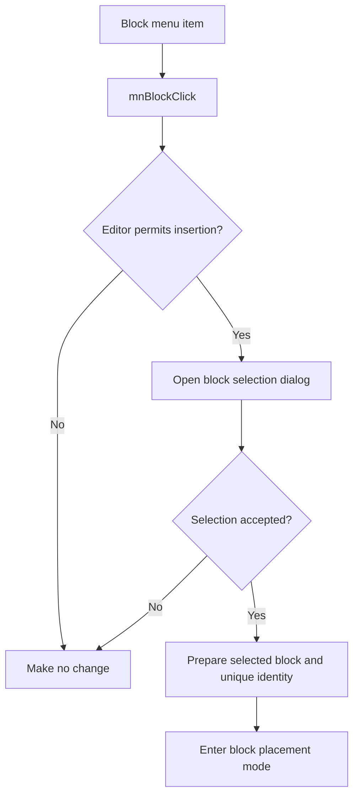

# B&lock...

> Analysis status: Reviewed with recovered selection and placement evidence.

## Control

| Property | Recovered value |
| --- | --- |
| Component path | `SchematicEditor.MainMenu.Insert.mnBlock` |
| Control class | `TMenuItem` |
| Handler | `mnBlockClick` at `01c93170` |

## What happens when clicked

The command first tests whether the editor permits an insertion command. If it does, the block path opens the recovered selection dialog. Cancel or a missing selection makes no schematic change. After acceptance, the path copies the selected block data into a new placement object, assigns an unused identity, stores the object as the active insertion object, and enters placement mode.

## Click flow

## Evidence

- [Menu handler](../../../DecompiledSources/Tina16/functions/0000000001C93170__FUN_01c93170.c) applies the editor guard and calls the block path.
- [Block path](../../../DecompiledSources/Tina16/functions/0000000001C92BA0__FUN_01c92ba0.c) handles selection, object preparation, identity allocation, and placement-mode activation.
- [Selection helper](../../../DecompiledSources/Tina16/functions/000000000179CBE0__FUN_0179cbe0.c) returns success only after the modal dialog accepts a selected object.

## Analysis limits

- The recovered symbols do not give a Delphi class name for the prepared block object.
