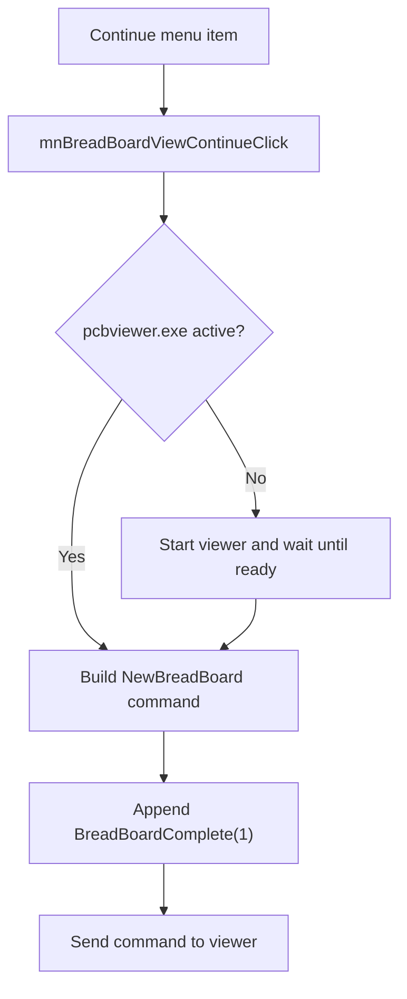

# Continue

> Analysis status: Reviewed with recovered external-viewer command evidence.

## Control

| Property | Recovered value |
| --- | --- |
| Component path | `SchematicEditor.MainMenu.View.mnBreadBoardView.mnBreadBoardViewContinue` |
| Control class | `TMenuItem` |
| Handler | `mnBreadBoardViewContinueClick` at `01ca19e0` |

## What happens when clicked

The command starts `pcbviewer.exe` when no matching viewer process is active and waits for its ready flag. It builds a `NewBreadBoard(...)` command from the configured breadboard component data and the current schematic context. It appends `BreadBoardComplete(1)` for continue mode and sends the command text to the external viewer path.

## Click flow

## Evidence

- [Menu handler](../../../DecompiledSources/Tina16/functions/0000000001CA19E0__FUN_01ca19e0.c) calls the common path with mode value `1`.
- [Breadboard path](../../../DecompiledSources/Tina16/functions/0000000001CA13B0__FUN_01ca13b0.c) checks or launches `pcbviewer.exe`, builds both command strings, and sends them.
- [Process check](../../../DecompiledSources/Tina16/functions/0000000001B1D9D0__FUN_01b1d9d0.c) searches active processes for the requested executable.

## Analysis limits

- The recovered code does not expose the viewer-side implementation of `BreadBoardComplete(1)`.
