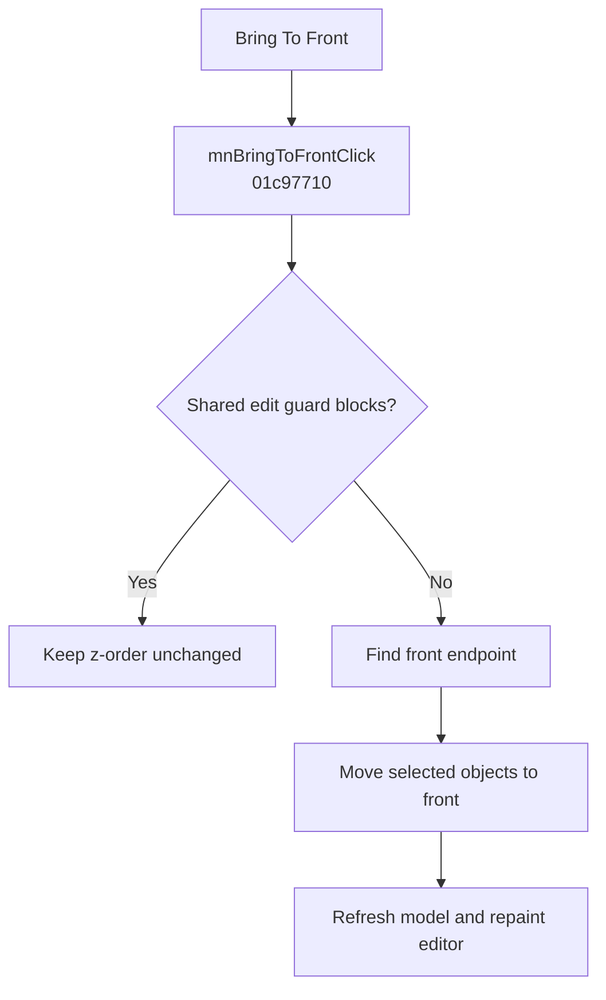

# &Bring To Front

> Analysis status: Evidence-backed behavior recovered.

## Control

| Property | Recovered value |
| --- | --- |
| Form | SchematicEditor |
| Component path | SchematicEditor.MainMenu.Edit.mnArrange.mnBringToFront |
| Control class | TMenuItem |
| Caption | &Bring To Front |
| Hint | Not present in the recovered resource. |
| Text | Not present in the recovered resource. |
| Handler name | mnBringToFrontClick |
| Handler address | 01c97710 |
| Graph node | `resource:dfm:SchematicEditor/SchematicEditor.MainMenu.Edit.mnArrange.mnBringToFront` |
| Handler node | `function:01c97710` |
| Graph layer | UI |

## What happens when clicked

The handler first calls the shared edit guard. If the guard blocks the operation, the click is a no-op. Otherwise, it calls `FUN_019965A0` for the schematic object list at form offset `0x27A8`. That helper locates the front endpoint, iterates the list from the end, and applies its reorder callback to selected movable objects. The handler then refreshes the model with `(0, 1, 0)` and invalidates the editor control at offset `0xA10`.

This moves the selected schematic objects to the front endpoint while it preserves their internal order. An empty selection, an ineligible selection, or a blocked edit state makes no z-order change.

## Click flow

## Handler evidence

- Source: [DecompiledSources/Tina16/functions/0000000001C97710__FUN_01c97710.c](../../../DecompiledSources/Tina16/functions/0000000001C97710__FUN_01c97710.c)
- Recovered role: Moves selected schematic objects to the front z-order endpoint.
- Current graph summary: Handles 1 Delphi UI event: SchematicEditor.MainMenu.Edit.mnArrange.mnBringToFront.OnClick.
- Current graph behavior: The handler applies the front-endpoint list reorder, then refreshes the schematic model and repaints the editor.
- Current graph evidence: `FUN_019965A0` selects the front endpoint and iterates selected movable objects in reverse list order. The one-step forward handler instead uses `FUN_01996820`.
- Complexity: complex
- Distinct outgoing calls: 4

## Direct calls

- `function:0064e770` — FUN_0064e770
- `function:019965a0` — FUN_019965a0
- `function:0199e310` — FUN_0199e310
- `function:01c8cee0` — FUN_01c8cee0

## Resource evidence

- Kind: Not present in the recovered resource.
- Modal result: Not present in the recovered resource.
- Checked state: Not present in the recovered resource.
- List items: Not present in the recovered resource.
- Image reference: Not present in the recovered resource.
- Extracted glyph: None.

## Nearby label candidates

Nearby labels are layout candidates only. They are not proof of behavior.

- No same-parent label candidate is available.

## Analysis limits

- The recovered source does not expose the displayed z-order number. It does prove the endpoint move and no-op guards.

