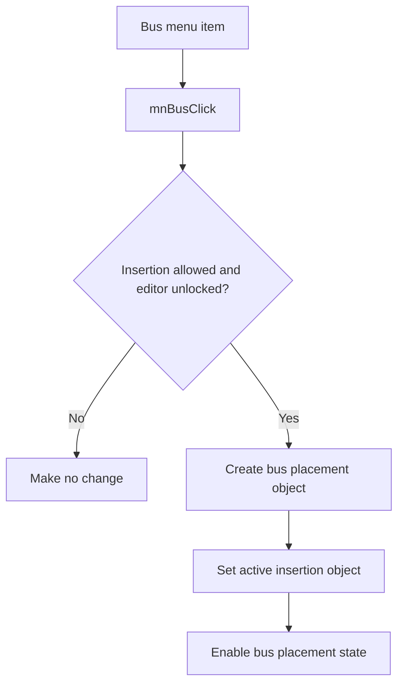

# &Bus

> Analysis status: Reviewed with recovered insertion-state evidence.

## Control

| Property | Recovered value |
| --- | --- |
| Component path | `SchematicEditor.MainMenu.Insert.mnBus` |
| Control class | `TMenuItem` |
| Handler | `mnBusClick` at `01c92b00` |

## What happens when clicked

The command does nothing when the editor blocks insertion or the global edit lock is active. Otherwise, it constructs the bus placement object, replaces any previous active insertion object with it, and enables the related placement state. The click stages bus placement. It does not add a bus to the schematic until the user completes placement.

## Click flow

## Evidence

- [Handler source](../../../DecompiledSources/Tina16/functions/0000000001C92B00__FUN_01c92b00.c) applies both guards, uses the bus-specific constructor, stores the active object, and enables its placement state.
- [Active-object setter](../../../DecompiledSources/Tina16/functions/0000000001C6CEE0__FUN_01c6cee0.c) disposes the previous insertion object before it stores the new object.

## Analysis limits

- The recovered constructor symbol does not expose the Delphi bus class name.
