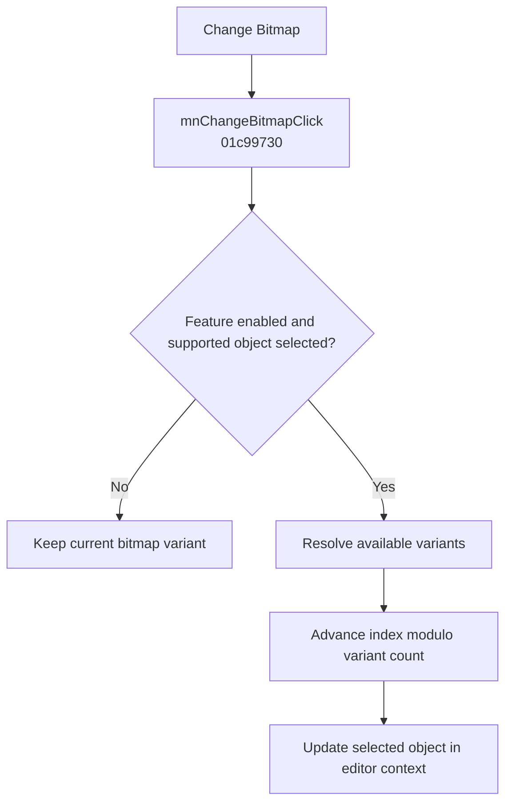

# Change &Bitmap

> Analysis status: Evidence-backed behavior recovered.

## Control

| Property | Recovered value |
| --- | --- |
| Form | SchematicEditor |
| Component path | SchematicEditor.MainMenu.Edit.mnChangeBitmap |
| Control class | TMenuItem |
| Caption | Change &Bitmap |
| Hint | Not present in the recovered resource. |
| Text | Not present in the recovered resource. |
| Handler name | mnChangeBitmapClick |
| Handler address | 01c99730 |
| Graph node | `resource:dfm:SchematicEditor/SchematicEditor.MainMenu.Edit.mnChangeBitmap` |
| Handler node | `function:01c99730` |
| Graph layer | UI |

## What happens when clicked

The click handler delegates to `FUN_01C99090`. That helper continues only when the bitmap-change feature flag is set and the current selection has the exact supported object VMT `PTR_FUN_01CF10A8`. It gets the editor context from model offset `0x210`, calls `FUN_01D072C0`, and then calls the selected object's virtual update method at `0xA0`.

`FUN_01D072C0` resolves the available bitmap variants and increments field `0x3B8` modulo the recovered variant count. An unavailable feature, missing selection, different object class, invalid variant source, or negative variant index makes no visible change.

## Click flow

## Handler evidence

- Source: [DecompiledSources/Tina16/functions/0000000001C99730__FUN_01c99730.c](../../../DecompiledSources/Tina16/functions/0000000001C99730__FUN_01c99730.c)
- Recovered role: Advances the selected bitmap-capable object's display variant.
- Current graph summary: Handles 1 Delphi UI event: SchematicEditor.MainMenu.Edit.mnChangeBitmap.OnClick.
- Current graph behavior: The wrapper calls a class-guarded bitmap-variant cycle and then updates the selected object.
- Current graph evidence: `FUN_01C99090` tests the feature flag and exact VMT. `FUN_01D072C0` increments field `0x3B8` modulo the variant count returned for the object's bitmap family.
- Complexity: simple
- Distinct outgoing calls: 1

## Direct calls

- `function:01c99090` — FUN_01c99090

## Resource evidence

- Kind: Not present in the recovered resource.
- Modal result: Not present in the recovered resource.
- Checked state: Not present in the recovered resource.
- List items: Not present in the recovered resource.
- Image reference: Not present in the recovered resource.
- Extracted glyph: None.

## Nearby label candidates

Nearby labels are layout candidates only. They are not proof of behavior.

- No same-parent label candidate is available.

## Analysis limits

- The recovered RTTI does not give a Delphi name for the supported object class or field `0x3B8`. The variant-cycle behavior is proven.

