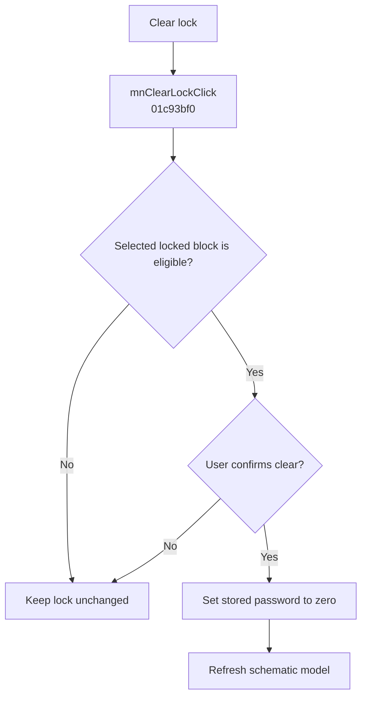

# Clear lock

> Analysis status: Evidence-backed behavior recovered.

## Control

| Property | Recovered value |
| --- | --- |
| Form | SchematicEditor |
| Component path | SchematicEditor.MainMenu.Edit.Sharing1.mnClearLock |
| Control class | TMenuItem |
| Caption | Clear lock |
| Hint | Not present in the recovered resource. |
| Text | Not present in the recovered resource. |
| Handler name | mnClearLockClick |
| Handler address | 01c93bf0 |
| Graph node | `resource:dfm:SchematicEditor/SchematicEditor.MainMenu.Edit.Sharing1.mnClearLock` |
| Handler node | `function:01c93bf0` |
| Graph layer | UI |

## What happens when clicked

The handler gets the current selection from the schematic model at form offset `0x27A8`. It continues only when the selected object exists, has recovered type value 4, passes the edit predicate, has its lock-capable flag set, and has a stored password. It then asks, “Are you sure you want to clear the lock on the selected block?” Only the Yes result, value 6, calls the selected block's password setter with zero and refreshes the model. All failed guards and other responses make no change.

## Click flow

## Handler evidence

- Source: [DecompiledSources/Tina16/functions/0000000001C93BF0__FUN_01c93bf0.c](../../../DecompiledSources/Tina16/functions/0000000001C93BF0__FUN_01c93bf0.c)
- Recovered role: Clears the selected block lock after confirmation.
- Current graph summary: Handles 1 Delphi UI event: SchematicEditor.MainMenu.Edit.Sharing1.mnClearLock.OnClick.
- Current graph behavior: The handler validates the selected locked block, requests confirmation, clears its stored password only for Yes, and refreshes the model.
- Current graph evidence: The source contains the exact confirmation text, tests result 6, calls the selected object's virtual setter with zero, and then calls `FUN_0199E310`.
- Complexity: complex
- Distinct outgoing calls: 5

## Direct calls

- `function:0072d440` — FUN_0072d440
- `function:0198a580` — FUN_0198a580
- `function:01993ec0` — FUN_01993ec0
- `function:0199e310` — FUN_0199e310
- `function:01d04d40` — FUN_01d04d40

## Resource evidence

- Kind: Not present in the recovered resource.
- Modal result: Not present in the recovered resource.
- Checked state: Not present in the recovered resource.
- List items: Not present in the recovered resource.
- Image reference: Not present in the recovered resource.
- Extracted glyph: None.

## Nearby label candidates

Nearby labels are layout candidates only. They are not proof of behavior.

- No same-parent label candidate is available.

## Analysis limits

- The source proves the password-field reset. It does not expose the persistent file format used for that field.

