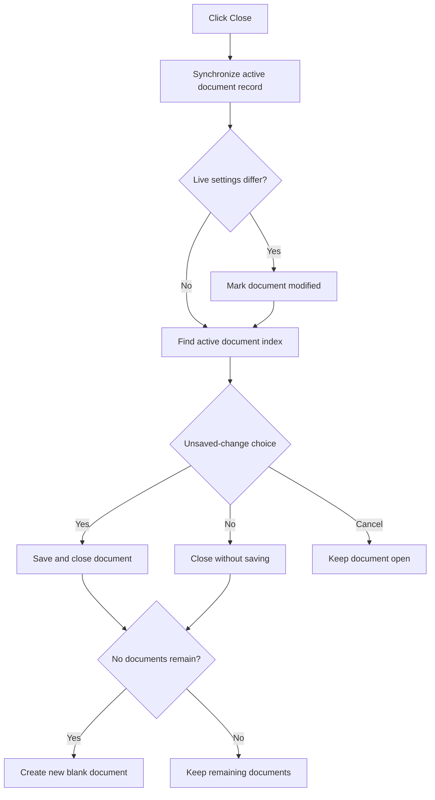

# &Close

> Analysis status: Reviewed from the active-record, modified-state, save-prompt, close, and blank-document paths.

## Control

| Property | Recovered value |
| --- | --- |
| Form | SchematicEditor |
| Component path | SchematicEditor.MainMenu.mnFile.mnClose |
| Control class | TMenuItem |
| Caption | &Close |
| Hint | Not present in the recovered resource. |
| Text | Not present in the recovered resource. |
| Handler name | mnCloseClick |
| Handler address | 01c94450 |
| Graph node | `resource:dfm:SchematicEditor/SchematicEditor.MainMenu.mnFile.mnClose` |
| Handler node | `function:01c94450` |
| Graph layer | UI |

## What happens when clicked

The handler synchronizes the active document record with the live editor state. If its saved settings differ from the live settings, it marks the document as modified before it copies the live settings into the record. It finds the active document's open-list index and calls the common close helper. For unsaved changes, that helper offers Yes, No, and Cancel. Yes saves and then closes, No closes without saving, and Cancel keeps the document open. If the close leaves no open documents, the handler creates a new blank document.

## Click flow

## Handler evidence

- Source: [DecompiledSources/Tina16/functions/0000000001C94450__FUN_01c94450.c](../../../DecompiledSources/Tina16/functions/0000000001C94450__FUN_01c94450.c)
- Recovered role: Close the active schematic document with unsaved-change handling.
- Current graph summary: Handles 1 Delphi UI event: SchematicEditor.MainMenu.mnFile.mnClose.OnClick.
- Current graph behavior: Synchronizes and closes the active document, permits save, discard, or cancel for unsaved work, and creates a blank document when none remain.
- Current graph evidence: `FUN_01c94450` compares the active document snapshot through `FUN_01d0fb00`, calls `FUN_0199e310` when it differs, copies the live settings, locates the record through `FUN_01c8a290`, and calls `FUN_01c94060`. The close helper shows the three-result prompt, saves on result 6, stops on result 2, and removes the document only on a permitted close. The handler calls `FUN_01c77470` when the final list count is zero.
- Complexity: complex
- Distinct outgoing calls: 7

## Direct calls

- `function:00417c40` — FUN_00417c40
- `function:0199e310` — FUN_0199e310
- `function:01c77470` — FUN_01c77470
- `function:01c8a290` — FUN_01c8a290
- `function:01c8a3c0` — FUN_01c8a3c0
- `function:01c94060` — FUN_01c94060
- `function:01d0fb00` — FUN_01d0fb00

## Resource evidence

- Kind: Not present in the recovered resource.
- Modal result: Not present in the recovered resource.
- Checked state: Not present in the recovered resource.
- List items: Not present in the recovered resource.
- Image reference: Not present in the recovered resource.
- Extracted glyph: None.

## Nearby label candidates

Nearby labels are layout candidates only. They are not proof of behavior.

- No same-parent label candidate is available.

## Analysis limits

- The localized prompt text is resource-backed; the recovered source proves the Yes, No, and Cancel branches but not every build's final wording.
- Save and close errors are handled below the common helper.

