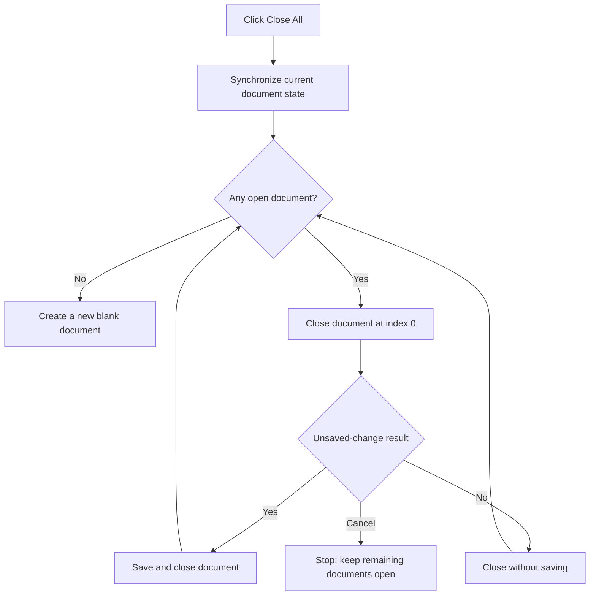

# C&lose All

> Analysis status: Reviewed from recovered document-list, modified-state, close-prompt, and new-document paths.

## Control

| Property | Recovered value |
| --- | --- |
| Form | SchematicEditor |
| Component path | SchematicEditor.MainMenu.mnFile.mnCloseAll |
| Control class | TMenuItem |
| Caption | C&lose All |
| Hint | Not present in the recovered resource. |
| Text | Not present in the recovered resource. |
| Handler name | mnCloseAllClick |
| Handler address | 01c94500 |
| Graph node | `resource:dfm:SchematicEditor/SchematicEditor.MainMenu.mnFile.mnCloseAll` |
| Handler node | `function:01c94500` |
| Graph layer | UI |

## What happens when clicked

The handler first synchronizes the current document record with the live editor state. If the saved record and the live state differ, it marks the document as modified before it copies the live state into the record.

It then closes document index 0 until the open-document list is empty. `FUN_01c94060` asks about unsaved changes. Yes saves before closure, No closes without a save, and Cancel returns result 2. Cancel stops the loop and leaves that document and all later documents open. When every document closes, the handler calls `FUN_01c77470` to create a new blank document. Thus, a successful Close All does not leave the editor without a document.

## Click flow

## Handler evidence

- Source: [DecompiledSources/Tina16/functions/0000000001C94500__FUN_01c94500.c](../../../DecompiledSources/Tina16/functions/0000000001C94500__FUN_01c94500.c)
- Recovered role: Close all open schematic documents, with per-document unsaved-change handling.
- Current graph summary: Handles 1 Delphi UI event: SchematicEditor.MainMenu.mnFile.mnCloseAll.OnClick.
- Current graph behavior: Synchronizes the active record, repeatedly closes index 0, stops on Cancel, and creates a blank document after the list becomes empty.
- Current graph evidence: `FUN_01c94500` tests the list count at `+0x10`, passes a result variable to `FUN_01c94060`, stops when it becomes 2, and calls `FUN_01c77470` only when the final count is zero. `FUN_01c94060` contains the unsaved-change prompt and save branch.
- Complexity: complex
- Distinct outgoing calls: 6

## Direct calls

- `function:00417c40` — FUN_00417c40
- `function:0199e310` — FUN_0199e310
- `function:01c77470` — FUN_01c77470
- `function:01c8a3c0` — FUN_01c8a3c0
- `function:01c94060` — FUN_01c94060
- `function:01d0fb00` — FUN_01d0fb00

## Resource evidence

- Kind: Not present in the recovered resource.
- Modal result: Not present in the recovered resource.
- Checked state: Not present in the recovered resource.
- List items: Not present in the recovered resource.
- Image reference: Not present in the recovered resource.
- Extracted glyph: None.

## Nearby label candidates

Nearby labels are layout candidates only. They are not proof of behavior.

- No same-parent label candidate is available.

## Analysis limits

- The localized prompt text is loaded by resource ID. The recovered source proves the Yes, No, and Cancel branches, but it does not expose the final localized wording for every build.
- Errors from the save or close path are not caught in this handler.

