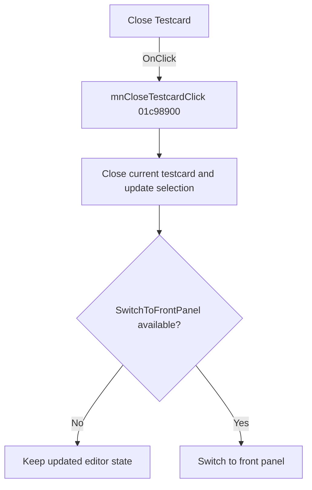

# &Close Testcard

> Analysis status: Reviewed from recovered source and resource evidence.

## Control

| Property | Recovered value |
| --- | --- |
| Form | SchematicEditor |
| Component path | SchematicEditor.MainMenu.mnTM.mnCloseTestcard |
| Control class | TMenuItem |
| Caption | &Close Testcard |
| Handler | mnCloseTestcardClick at `01c98900` |
| Graph node | `resource:dfm:SchematicEditor/SchematicEditor.MainMenu.mnTM.mnCloseTestcard` |

## What happens when clicked

The click closes the active testcard context and returns the application to the front panel. The handler first calls `01c94450`. That helper removes or closes the current object, updates the current selection, and restores the normal editor state when no testcard remains. The handler then calls `00e1dd50`, which resolves and calls the exported `SwitchToFrontPanel` function when that entry is available.

There is no local error dialog or retry path. If the front-panel module or its export is not available, the second helper does not call it.

## Click flow

## Handler evidence

- [Handler source](../../../DecompiledSources/Tina16/functions/0000000001C98900__FUN_01c98900.c) calls the close/update helper and then the front-panel helper.
- [Close/update source](../../../DecompiledSources/Tina16/functions/0000000001C94450__FUN_01c94450.c) updates the active object, selection, and editor state.
- [Front-panel source](../../../DecompiledSources/Tina16/functions/0000000000E1DD50__FUN_00e1dd50.c) resolves the literal export name `SwitchToFrontPanel` and calls it when available.
- The toolbar Close handler also calls `01c94450`, which confirms the close role of the shared helper.

## Analysis limits

- The recovered names of the internal active-object fields are not available.
