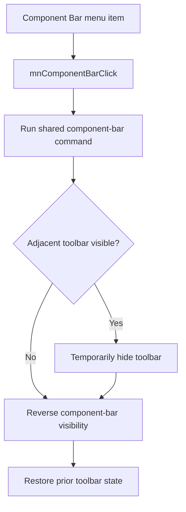

# &Component Bar

> Analysis status: Reviewed with recovered visibility-state evidence.

## Control

| Property | Recovered value |
| --- | --- |
| Component path | `SchematicEditor.MainMenu.View.mnComponentBar` |
| Control class | `TMenuItem` |
| Recovered checked state | `true` |
| Handler | `mnComponentBarClick` at `01c77330` |

## What happens when clicked

The menu handler runs the shared component-bar command. That command reverses the component panel's visible state. If the adjacent toolbar is visible, it hides that toolbar before the panel layout change and restores it afterward. Thus, the toolbar keeps its original visible state while the component bar changes.

## Click flow

## Evidence

- [Menu handler](../../../DecompiledSources/Tina16/functions/0000000001C77330__FUN_01c77330.c) delegates directly to the shared command.
- [Component-bar command](../../../DecompiledSources/Tina16/functions/0000000001C67D50__FUN_01c67d50.c) records the toolbar state, toggles the panel, and restores the toolbar when required.
- The same shared command is bound to `SchematicEditor.ToolsPopup.ComponentBar` in the UI evidence view.

## Analysis limits

- The recovered field offsets do not expose the Delphi names of the two panels.
