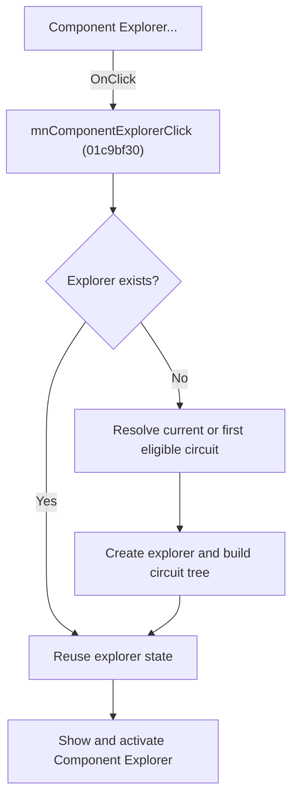

# Component Explorer...

> Analysis status: Source, graph, and form evidence reviewed.

## Control

| Property | Recovered value |
| --- | --- |
| Form | SchematicEditor |
| Component path | SchematicEditor.MainMenu.mnTools.mnComponentExplorer |
| Control class | TMenuItem |
| Caption | Component Explorer... |
| Hint | Not present in the recovered resource. |
| Text | Not present in the recovered resource. |
| Handler name | mnComponentExplorerClick |
| Handler address | 01c9bf30 |
| Graph node | `resource:dfm:SchematicEditor/SchematicEditor.MainMenu.mnTools.mnComponentExplorer` |
| Handler node | `function:01c9bf30` |
| Graph layer | UI |

## What happens when clicked

The command opens the singleton `frmComponentExplorer`. On the first click, it creates the form and initializes its circuit tree from the current Schematic Editor model. The selected circuit is the current circuit when one exists. Otherwise, the handler searches the editor's document items and uses the first item that has no attached child object. It also passes the editor's current model field to the explorer setup path.

After initialization, the handler shows and activates the Component Explorer. Later clicks reuse the existing explorer and do not rebuild its tree through this handler.

## Click flow

## Handler evidence

- Source: [DecompiledSources/Tina16/functions/0000000001C9BF30__FUN_01c9bf30.c](../../../DecompiledSources/Tina16/functions/0000000001C9BF30__FUN_01c9bf30.c)
- Recovered role: Creates, initializes, and opens the singleton Component Explorer.
- Current graph summary: Opens `frmComponentExplorer` and supplies the current circuit and Schematic Editor model on first creation.
- Current graph behavior: Initializes only a new instance. An existing explorer is shown and activated without a new tree build.
- Current graph evidence: The created class range contains the recovered `TfrmComponentExplorer` events. `FUN_01c8a450` returns `SchematicEditor +0x2788` or the first eligible item from the collection at `+0x2780`. `FUN_013ab910` clears and populates the explorer tree, and the outer handler calls VCL show and activation functions.
- Complexity: complex
- Distinct outgoing calls: 5

## Direct calls

- `function:0064e1d0` — FUN_0064e1d0
- `function:007fc180` — FUN_007fc180
- `function:008059a0` — FUN_008059a0
- `function:013ab910` — FUN_013ab910
- `function:01c8a450` — FUN_01c8a450

## Resource evidence

- Kind: Not present in the recovered resource.
- Modal result: Not present in the recovered resource.
- Checked state: Not present in the recovered resource.
- List items: Not present in the recovered resource.
- Image reference: Not present in the recovered resource.
- Extracted glyph: None.

## Nearby label candidates

Nearby labels are layout candidates only. They are not proof of behavior.

- No same-parent label candidate is available.

## Analysis limits

- The recovered source does not give a user-facing label for the fallback document item.
- This handler does not refresh the tree of an explorer that already exists.

