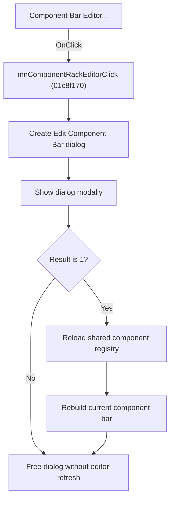

# &Component Bar Editor...

> Analysis status: Source, graph, and dialog evidence reviewed.

## Control

| Property | Recovered value |
| --- | --- |
| Form | SchematicEditor |
| Component path | SchematicEditor.MainMenu.mnTools.mnComponentRackEditor |
| Control class | TMenuItem |
| Caption | &Component Bar Editor... |
| Hint | Not present in the recovered resource. |
| Text | Not present in the recovered resource. |
| Handler name | mnComponentRackEditorClick |
| Handler address | 01c8f170 |
| Graph node | `resource:dfm:SchematicEditor/SchematicEditor.MainMenu.mnTools.mnComponentRackEditor` |
| Handler node | `function:01c8f170` |
| Graph layer | UI |

## What happens when clicked

The command creates `frmEditCompRack`, whose caption is `Edit Component Bar`, and shows it modally. If the dialog returns result `1`, the handler refreshes the Schematic Editor client, reloads the shared component registry, clears and rebuilds the current component-bar entries for the active category, and restores the normal application message state. It then frees the dialog.

If the user cancels, the handler skips all editor and component-bar refresh operations and only frees the temporary dialog. Validation and file changes inside the editor belong to `frmEditCompRack`; the outer handler has no additional error message or rollback branch.

## Click flow

## Handler evidence

- Source: [DecompiledSources/Tina16/functions/0000000001C8F170__FUN_01c8f170.c](../../../DecompiledSources/Tina16/functions/0000000001C8F170__FUN_01c8f170.c)
- Recovered role: Opens the Component Bar Editor and reloads component bars after acceptance.
- Current graph summary: Shows `frmEditCompRack` modally and, for result `1`, refreshes the shared registry and rebuilds the active component bar.
- Current graph behavior: Cancel is a no-refresh path. Both paths free the temporary dialog.
- Current graph evidence: The class at `PTR_FUN_01b92c88` maps to recovered form `TfrmEditCompRack`, caption `Edit Component Bar`. The handler tests modal virtual slot `+0x2D0` for `1`, calls the registry clear and reload helpers, and calls `FUN_01c691d0`, which clears and repopulates the component-bar controls for the category at editor offset `0x1810`.
- Complexity: complex
- Distinct outgoing calls: 6

## Direct calls

- `function:00410f20` — Nil-safe Delphi object destruction helper
- `function:007fc180` — FUN_007fc180
- `function:008088b0` — FUN_008088b0
- `function:00c82c10` — FUN_00c82c10
- `function:00c85140` — FUN_00c85140
- `function:01c691d0` — FUN_01c691d0

## Resource evidence

- Kind: Not present in the recovered resource.
- Modal result: Not present in the recovered resource.
- Checked state: Not present in the recovered resource.
- List items: Not present in the recovered resource.
- Image reference: Not present in the recovered resource.
- Extracted glyph: None.

## Nearby label candidates

Nearby labels are layout candidates only. They are not proof of behavior.

- No same-parent label candidate is available.

## Analysis limits

- The outer handler does not expose which files or groups the modal dialog changed.
- The registry reload helpers do not return a status to this handler.

