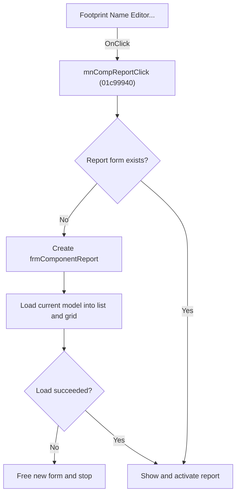

# Footprint Name Editor...

> Analysis status: Source, graph, report, and model evidence reviewed.

## Control

| Property | Recovered value |
| --- | --- |
| Form | SchematicEditor |
| Component path | SchematicEditor.MainMenu.mnTools.mnPCBTools.mnCompReport |
| Control class | TMenuItem |
| Caption | Footprint Name Editor... |
| Hint | Not present in the recovered resource. |
| Text | Not present in the recovered resource. |
| Handler name | mnCompReportClick |
| Handler address | 01c99940 |
| Graph node | `resource:dfm:SchematicEditor/SchematicEditor.MainMenu.mnTools.mnPCBTools.mnCompReport` |
| Handler node | `function:01c99940` |
| Graph layer | UI |

## What happens when clicked

The command opens the singleton `frmComponentReport`, whose caption is `Footprint Name Editor`. On the first click, it creates the form and loads the current Schematic Editor model into the report. The loader fills the component list and the two-column footprint grid. If model loading fails, the handler frees the new form and does not show it.

If loading succeeds, or if the report already exists, the handler shows and activates the Footprint Name Editor. An existing report is reused without a new model load through this handler.

## Click flow

## Handler evidence

- Source: [DecompiledSources/Tina16/functions/0000000001C99940__FUN_01c99940.c](../../../DecompiledSources/Tina16/functions/0000000001C99940__FUN_01c99940.c)
- Recovered role: Creates, loads, and opens the singleton Footprint Name Editor.
- Current graph summary: Initializes `frmComponentReport` from the current model and shows it only when loading succeeds.
- Current graph behavior: A failed first load frees the new form. An existing form is shown and activated without a reload.
- Current graph evidence: The class at `PTR_FUN_01bb5178` maps to `TfrmComponentReport`, caption `Footprint Name Editor`. `FUN_01bb5f00` stores the model at form `+0x6F0`, loads component names and footprint values into the backing list and grid, and returns its load result. The handler tests that result before VCL show and activation calls.
- Complexity: complex
- Distinct outgoing calls: 5

## Direct calls

- `function:00410f20` — Nil-safe Delphi object destruction helper
- `function:0064e1d0` — FUN_0064e1d0
- `function:007fc180` — FUN_007fc180
- `function:008059a0` — FUN_008059a0
- `function:01bb5f00` — FUN_01bb5f00

## Resource evidence

- Kind: Not present in the recovered resource.
- Modal result: Not present in the recovered resource.
- Checked state: Not present in the recovered resource.
- List items: Not present in the recovered resource.
- Image reference: Not present in the recovered resource.
- Extracted glyph: None.

## Nearby label candidates

Nearby labels are layout candidates only. They are not proof of behavior.

- No same-parent label candidate is available.

## Analysis limits

- This handler does not refresh an already open report. Refresh and renumber controls have separate event paths.
- The model loader has no user-visible error call in this outer command.

