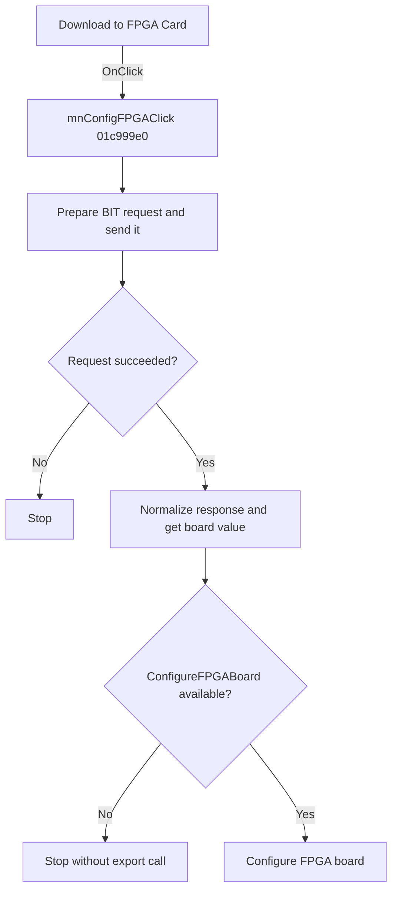

# Download to FPGA Card...

> Analysis status: Reviewed from recovered source and resource evidence.

## Control

| Property | Recovered value |
| --- | --- |
| Form | SchematicEditor |
| Component path | SchematicEditor.MainMenu.mnTM.mnConfigFPGA |
| Control class | TMenuItem |
| Caption | Download to FPGA Card... |
| Handler | mnConfigFPGAClick at `01c999e0` |
| Graph node | `resource:dfm:SchematicEditor/SchematicEditor.MainMenu.mnTM.mnConfigFPGA` |

## What happens when clicked

The click prepares a download request for the FPGA card. The handler sets request mode `1`, stores the `BIT` file-type text, builds a request string, and sends it through the request control at form offset `1258`.

If the control does not return success, the handler stops. On success, it reads and normalizes the returned text, sends the normalized value back through the control, reads the next response, extracts its first value, converts it to an integer, and passes that value to `00e1e1a0`. That helper resolves and calls the exported `ConfigureFPGABoard` function when the FPGA module and export are available.

## Click flow

## Handler evidence

- [Handler source](../../../DecompiledSources/Tina16/functions/0000000001C999E0__FUN_01c999e0.c) proves the request state, success branch, response conversion, and call to `00e1e1a0`.
- [FPGA helper source](../../../DecompiledSources/Tina16/functions/0000000000E1E1A0__FUN_00e1e1a0.c) resolves the literal export name `ConfigureFPGABoard` and calls it with the converted value.
- Recovered runtime data at `01c99b64` contains the `BIT` text used by the handler.

## Analysis limits

- The command-string fields and returned integer do not have recovered Delphi names.
