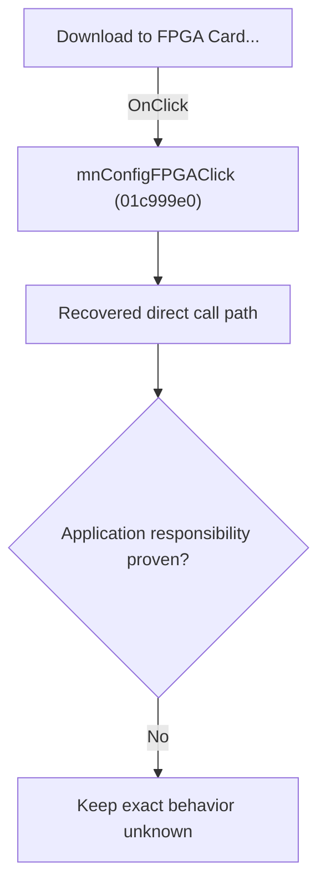

# Download to FPGA Card...

> Analysis status: Blocked by an exact evidence gap.

## Control

| Property | Recovered value |
| --- | --- |
| Form | SchematicEditor |
| Component path | SchematicEditor.MainMenu.mnTM.mnConfigFPGA |
| Control class | TMenuItem |
| Caption | Download to FPGA Card... |
| Hint | Not present in the recovered resource. |
| Text | Not present in the recovered resource. |
| Handler name | mnConfigFPGAClick |
| Handler address | 01c999e0 |
| Graph node | `resource:dfm:SchematicEditor/SchematicEditor.MainMenu.mnTM.mnConfigFPGA` |
| Handler node | `function:01c999e0` |
| Graph layer | UI |

## What happens when clicked

The OnClick binding reaches mnConfigFPGAClick at 01c999e0. The recovered body has 10 distinct outgoing graph call(s), but the application-specific responsibilities and data effects of its downstream path are not established in the accepted graph evidence. The control's caption or name indicates user intent only; it is not enough to claim implementation behavior.

## Click flow

## Handler evidence

- Source: [DecompiledSources/Tina16/functions/0000000001C999E0__FUN_01c999e0.c](../../../DecompiledSources/Tina16/functions/0000000001C999E0__FUN_01c999e0.c)
- Recovered role: Evidence-blocked mnConfigFPGAClick command.
- Current graph summary: Handles 1 Delphi UI event: SchematicEditor.MainMenu.mnTM.mnConfigFPGA.OnClick.
- Current graph behavior: The OnClick binding reaches mnConfigFPGAClick at 01c999e0. The recovered body has 10 distinct outgoing graph call(s), but the application-specific responsibilities and data effects of its downstream path are not established in the accepted graph evidence. The control's caption or name indicates user intent only; it is not enough to claim implementation behavior.
- Current graph evidence: The DFM binds SchematicEditor.MainMenu.mnTM.mnConfigFPGA to mnConfigFPGAClick. The recovered source is DecompiledSources/Tina16/functions/0000000001C999E0__FUN_01c999e0.c and directly references 004144d0, 00414560, 00414ad0, 00415dd0, 00416cd0, 0043e1a0, 004425e0, 00724270, and 2 more. No accepted end-to-end role was established for this control path.
- Complexity: complex
- Distinct outgoing calls: 10

## Direct calls

- `function:004144d0` — FUN_004144d0
- `function:00414560` — Delphi UnicodeString array finalization helper
- `function:00414ad0` — Delphi UnicodeString assignment helper
- `function:00415dd0` — FUN_00415dd0
- `function:00416cd0` — FUN_00416cd0
- `function:0043e1a0` — FUN_0043e1a0
- `function:004425e0` — FUN_004425e0
- `function:00724270` — FUN_00724270
- `function:00724380` — FUN_00724380
- `function:00e1e1a0` — FUN_00e1e1a0

## Resource evidence

- Kind: Not present in the recovered resource.
- Modal result: Not present in the recovered resource.
- Checked state: Not present in the recovered resource.
- List items: Not present in the recovered resource.
- Image reference: Not present in the recovered resource.
- Extracted glyph: None.

## Nearby label candidates

Nearby labels are layout candidates only. They are not proof of behavior.

- No same-parent label candidate is available.

## Analysis limits

- Exact gap: the recovered handler or one of its direct application callees lacks a source-supported role that proves the command's decisions, state changes, and output. Keep this Bead open until those callees are traced.

