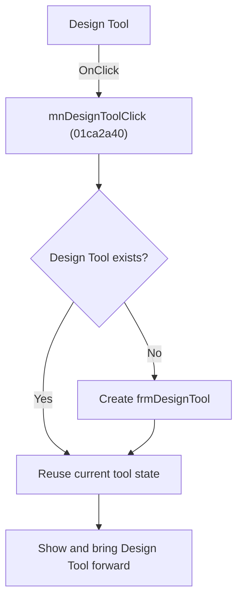

# Design Tool

> Analysis status: Source, graph, and form evidence reviewed.

## Control

| Property | Recovered value |
| --- | --- |
| Form | SchematicEditor |
| Component path | SchematicEditor.MainMenu.mnTools.mnDesignTool |
| Control class | TMenuItem |
| Caption | Design Tool |
| Hint | Not present in the recovered resource. |
| Text | Not present in the recovered resource. |
| Handler name | mnDesignToolClick |
| Handler address | 01ca2a40 |
| Graph node | `resource:dfm:SchematicEditor/SchematicEditor.MainMenu.mnTools.mnDesignTool` |
| Handler node | `function:01ca2a40` |
| Graph layer | UI |

## What happens when clicked

The command opens the singleton `frmDesignTool`. It creates the form only when the shared pointer is empty. It then shows the form, gets its native window handle, and calls the recovered native foreground or restore thunk for that handle. A later click reuses the existing Design Tool and preserves its editor and terminal state.

## Click flow

## Handler evidence

- Source: [DecompiledSources/Tina16/functions/0000000001CA2A40__FUN_01ca2a40.c](../../../DecompiledSources/Tina16/functions/0000000001CA2A40__FUN_01ca2a40.c)
- Recovered role: Creates or restores the singleton Design Tool.
- Current graph summary: Opens `frmDesignTool`, reusing an existing instance when present.
- Current graph behavior: Creates only on the first request, shows the form, and brings its native window forward.
- Current graph evidence: The form class at `PTR_FUN_014906e8` maps to `TfrmDesignTool`; recovered events and the DFM caption identify it as `Design Tool`. The handler stores it in `PTR_DAT_02005498`, calls the annotated VCL show helper, gets its native handle, and calls the recovered native thunk.
- Complexity: complex
- Distinct outgoing calls: 3

## Direct calls

- `function:0065b870` — FUN_0065b870
- `function:007fc180` — FUN_007fc180
- `function:008059a0` — FUN_008059a0

## Resource evidence

- Kind: Not present in the recovered resource.
- Modal result: Not present in the recovered resource.
- Checked state: Not present in the recovered resource.
- List items: Not present in the recovered resource.
- Image reference: Not present in the recovered resource.
- Extracted glyph: None.

## Nearby label candidates

Nearby labels are layout candidates only. They are not proof of behavior.

- No same-parent label candidate is available.

## Analysis limits

- The import name for the final native window thunk is not present in the graph.
- The handler does not reset the Design Tool document or terminal on reuse.

