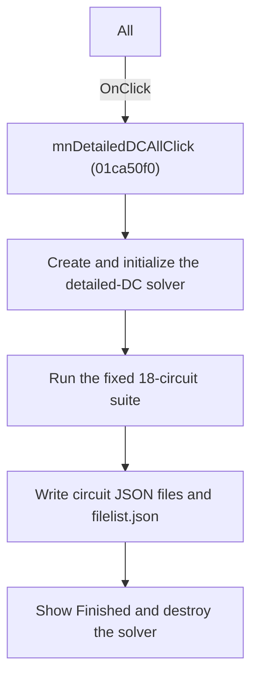

# All

> Analysis status: Reviewed from recovered source and graph evidence.

## Control

| Property | Recovered value |
| --- | --- |
| Form | SchematicEditor |
| Component path | SchematicEditor.MainMenu.mnAnalysis.mnDetailedDC.mnDetailedDCAll |
| Control class | TMenuItem |
| Caption | All |
| Handler name | mnDetailedDCAllClick |
| Handler address | 01ca50f0 |
| Graph node | `resource:dfm:SchematicEditor/SchematicEditor.MainMenu.mnAnalysis.mnDetailedDC.mnDetailedDCAll` |
| Handler node | `function:01ca50f0` |
| Graph layer | UI |

## What happens when clicked

Creates and initializes the detailed-DC Python solver object, runs the fixed circuit suite, and destroys the object.

## Click flow

## Handler evidence

- Source: [DecompiledSources/Tina16/functions/0000000001CA50F0__FUN_01ca50f0.c](../../../DecompiledSources/Tina16/functions/0000000001CA50F0__FUN_01ca50f0.c)
- Recovered role: Run all recovered detailed-DC test circuits.
- Evidence: The handler constructs the object through FUN_01a33340, initializes it through FUN_01a33cd0, invokes FUN_01a36470, and destroys it. FUN_01a36470 processes a fixed 18-circuit suite, writes per-circuit JSON plus filelist.json, and shows Finished. A local mode byte differs from Autotest, but the recovered call signature does not show its downstream use.

## Application-relevant calls

- FUN_01a33cd0 initializes the Python circuit solver; FUN_01a36470 runs the fixed suite.

## Resource evidence

- The DFM binds this menu item to `mnDetailedDCAllClick`.
- The recovered caption is `All`.
- No extracted glyph is associated with this control.

## Analysis limits

- The recovered names of some form fields and global state bytes are not available. This article identifies them by stable offsets and proven readers or writers where necessary.