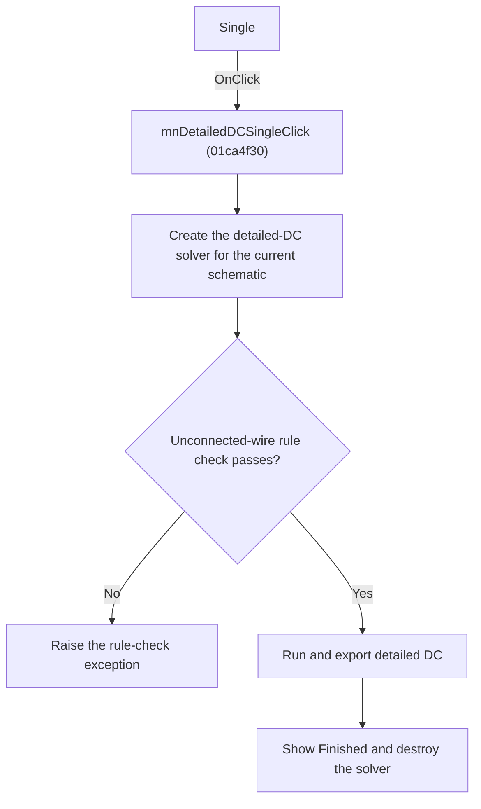

# Single

> Analysis status: Reviewed from recovered source and graph evidence.

## Control

| Property | Recovered value |
| --- | --- |
| Form | SchematicEditor |
| Component path | SchematicEditor.MainMenu.mnAnalysis.mnDetailedDC.mnDetailedDCSingle |
| Control class | TMenuItem |
| Caption | Single |
| Handler name | mnDetailedDCSingleClick |
| Handler address | 01ca4f30 |
| Graph node | `resource:dfm:SchematicEditor/SchematicEditor.MainMenu.mnAnalysis.mnDetailedDC.mnDetailedDCSingle` |
| Handler node | `function:01ca4f30` |
| Graph layer | UI |

## What happens when clicked

Runs detailed DC for the current schematic with the embedded Python solver and shows Finished with the produced path or name after the run returns. An unconnected-wire rule-check exception prevents that completion message.

## Click flow

## Handler evidence

- Source: [DecompiledSources/Tina16/functions/0000000001CA4F30__FUN_01ca4f30.c](../../../DecompiledSources/Tina16/functions/0000000001CA4F30__FUN_01ca4f30.c)
- Recovered role: Run detailed DC for the current schematic.
- Evidence: The handler resolves the current circuit with FUN_019a4600, constructs and initializes the solver, calls FUN_01a37700, formats Finished from the solver string at +200, and destroys the object. FUN_01a37700 performs an electrical rule check and raises Electric rule check error: some wires are not connected when required.

## Application-relevant calls

- FUN_01a37700 performs the current-circuit detailed-DC export and solver work.

## Resource evidence

- The DFM binds this menu item to `mnDetailedDCSingleClick`.
- The recovered caption is `Single`.
- No extracted glyph is associated with this control.

## Analysis limits

- The recovered names of some form fields and global state bytes are not available. This article identifies them by stable offsets and proven readers or writers where necessary.