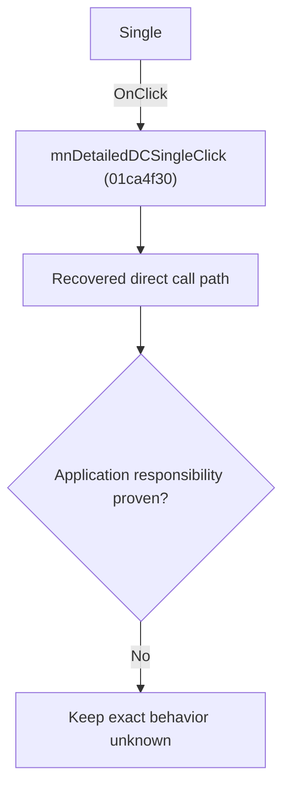

# Single

> Analysis status: Blocked by an exact evidence gap.

## Control

| Property | Recovered value |
| --- | --- |
| Form | SchematicEditor |
| Component path | SchematicEditor.MainMenu.mnAnalysis.mnDetailedDC.mnDetailedDCSingle |
| Control class | TMenuItem |
| Caption | Single |
| Hint | Not present in the recovered resource. |
| Text | Not present in the recovered resource. |
| Handler name | mnDetailedDCSingleClick |
| Handler address | 01ca4f30 |
| Graph node | `resource:dfm:SchematicEditor/SchematicEditor.MainMenu.mnAnalysis.mnDetailedDC.mnDetailedDCSingle` |
| Handler node | `function:01ca4f30` |
| Graph layer | UI |

## What happens when clicked

The OnClick binding reaches mnDetailedDCSingleClick at 01ca4f30. The recovered body has 8 distinct outgoing graph call(s), but the application-specific responsibilities and data effects of its downstream path are not established in the accepted graph evidence. The control's caption or name indicates user intent only; it is not enough to claim implementation behavior.

## Click flow

## Handler evidence

- Source: [DecompiledSources/Tina16/functions/0000000001CA4F30__FUN_01ca4f30.c](../../../DecompiledSources/Tina16/functions/0000000001CA4F30__FUN_01ca4f30.c)
- Recovered role: Evidence-blocked mnDetailedDCSingleClick command.
- Current graph summary: Handles 1 Delphi UI event: SchematicEditor.MainMenu.mnAnalysis.mnDetailedDC.mnDetailedDCSingle.OnClick.
- Current graph behavior: The OnClick binding reaches mnDetailedDCSingleClick at 01ca4f30. The recovered body has 8 distinct outgoing graph call(s), but the application-specific responsibilities and data effects of its downstream path are not established in the accepted graph evidence. The control's caption or name indicates user intent only; it is not enough to claim implementation behavior.
- Current graph evidence: The DFM binds SchematicEditor.MainMenu.mnAnalysis.mnDetailedDC.mnDetailedDCSingle to mnDetailedDCSingleClick. The recovered source is DecompiledSources/Tina16/functions/0000000001CA4F30__FUN_01ca4f30.c and directly references 00410f20, 00414480, 00442f70, 0072d440, 019a4600, 01a33340, 01a33cd0, 01a37700. No accepted end-to-end role was established for this control path.
- Complexity: complex
- Distinct outgoing calls: 8

## Direct calls

- `function:00410f20` — Nil-safe Delphi object destruction helper
- `function:00414480` — Delphi UnicodeString clear and finalization helper
- `function:00442f70` — FUN_00442f70
- `function:0072d440` — FUN_0072d440
- `function:019a4600` — FUN_019a4600
- `function:01a33340` — FUN_01a33340
- `function:01a33cd0` — FUN_01a33cd0
- `function:01a37700` — FUN_01a37700

## Resource evidence

- Kind: Not present in the recovered resource.
- Modal result: Not present in the recovered resource.
- Checked state: Not present in the recovered resource.
- List items: Not present in the recovered resource.
- Image reference: Not present in the recovered resource.
- Extracted glyph: None.

## Nearby label candidates

Nearby labels are layout candidates only. They are not proof of behavior.

- No same-parent label candidate is available.

## Analysis limits

- Exact gap: the recovered handler or one of its direct application callees lacks a source-supported role that proves the command's decisions, state changes, and output. Keep this Bead open until those callees are traced.

