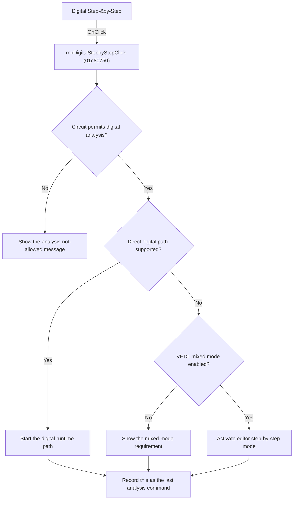

# Digital Step-by-Step

> Analysis status: Reviewed from recovered source and graph evidence.

## Control

| Property | Recovered value |
| --- | --- |
| Form | SchematicEditor |
| Component path | SchematicEditor.MainMenu.mnAnalysis.mnDigitalStepbyStep |
| Control class | TMenuItem |
| Caption | Digital Step-&by-Step |
| Handler name | mnDigitalStepbyStepClick |
| Handler address | 01c80750 |
| Graph node | `resource:dfm:SchematicEditor/SchematicEditor.MainMenu.mnAnalysis.mnDigitalStepbyStep` |
| Handler node | `function:01c80750` |
| Graph layer | UI |

## What happens when clicked

Validates the current circuit for digital analysis. Invalid circuits show the localized analysis-not-allowed message. Valid circuits start the supported digital path or require VHDL mixed mode; the handler then records this command as the last analysis command.

## Click flow

## Handler evidence

- Source: [DecompiledSources/Tina16/functions/0000000001C80750__FUN_01c80750.c](../../../DecompiledSources/Tina16/functions/0000000001C80750__FUN_01c80750.c)
- Recovered role: Validate and enter digital step-by-step analysis.
- Evidence: The handler builds current-circuit state, evaluates recovered compatibility bytes, and shows Sched_c.sAnaNotAllowedTxt on invalid input. On valid input it calls FUN_01500620 for the supported path or checks mixed-mode enablement and calls FUN_01c80a70. FUN_01c80a70 sets mode 2, synchronizes toolbar and menu state, invokes the common interactive handler, and marks editor state +0x18e8.

## Application-relevant calls

- FUN_01c80a70 activates the editor digital step-by-step interaction; FUN_01c87e40 applies the common interactive-mode transition.

## Resource evidence

- The DFM binds this menu item to `mnDigitalStepbyStepClick`.
- The recovered caption is `Digital Step-&by-Step`.
- No extracted glyph is associated with this control.

## Analysis limits

- The recovered names of some form fields and global state bytes are not available. This article identifies them by stable offsets and proven readers or writers where necessary.