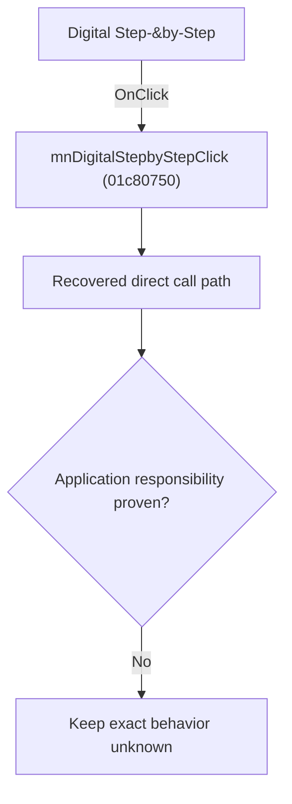

# Digital Step-&by-Step

> Analysis status: Blocked by an exact evidence gap.

## Control

| Property | Recovered value |
| --- | --- |
| Form | SchematicEditor |
| Component path | SchematicEditor.MainMenu.mnAnalysis.mnDigitalStepbyStep |
| Control class | TMenuItem |
| Caption | Digital Step-&by-Step |
| Hint | Not present in the recovered resource. |
| Text | Not present in the recovered resource. |
| Handler name | mnDigitalStepbyStepClick |
| Handler address | 01c80750 |
| Graph node | `resource:dfm:SchematicEditor/SchematicEditor.MainMenu.mnAnalysis.mnDigitalStepbyStep` |
| Handler node | `function:01c80750` |
| Graph layer | UI |

## What happens when clicked

The OnClick binding reaches mnDigitalStepbyStepClick at 01c80750. The recovered body has 20 distinct outgoing graph call(s), but the application-specific responsibilities and data effects of its downstream path are not established in the accepted graph evidence. The control's caption or name indicates user intent only; it is not enough to claim implementation behavior.

## Click flow

## Handler evidence

- Source: [DecompiledSources/Tina16/functions/0000000001C80750__FUN_01c80750.c](../../../DecompiledSources/Tina16/functions/0000000001C80750__FUN_01c80750.c)
- Recovered role: Evidence-blocked mnDigitalStepbyStepClick command.
- Current graph summary: Handles 1 Delphi UI event: SchematicEditor.MainMenu.mnAnalysis.mnDigitalStepbyStep.OnClick.
- Current graph behavior: The OnClick binding reaches mnDigitalStepbyStepClick at 01c80750. The recovered body has 20 distinct outgoing graph call(s), but the application-specific responsibilities and data effects of its downstream path are not established in the accepted graph evidence. The control's caption or name indicates user intent only; it is not enough to claim implementation behavior.
- Current graph evidence: The DFM binds SchematicEditor.MainMenu.mnAnalysis.mnDigitalStepbyStep to mnDigitalStepbyStepClick. The recovered source is DecompiledSources/Tina16/functions/0000000001C80750__FUN_01c80750.c and directly references 00414480, 00414560, 00414ad0, 0041ddd0, 00b89270, 00b8e650, 01500620, 01542950, and 12 more. No accepted end-to-end role was established for this control path.
- Complexity: complex
- Distinct outgoing calls: 20

## Direct calls

- `function:00414480` — Delphi UnicodeString clear and finalization helper
- `function:00414560` — Delphi UnicodeString array finalization helper
- `function:00414ad0` — Delphi UnicodeString assignment helper
- `function:0041ddd0` — FUN_0041ddd0
- `function:00b89270` — FUN_00b89270
- `function:00b8e650` — FUN_00b8e650
- `function:01500620` — FUN_01500620
- `function:01542950` — FUN_01542950
- `function:015f23e0` — FUN_015f23e0
- `function:015fc1d0` — FUN_015fc1d0
- `function:015fca00` — FUN_015fca00
- `function:01610c90` — FUN_01610c90
- `function:01610cc0` — FUN_01610cc0
- `function:016fd940` — FUN_016fd940
- `function:019a02e0` — FUN_019a02e0
- `function:019a10d0` — FUN_019a10d0
- `function:019a1aa0` — FUN_019a1aa0
- `function:019a1cf0` — FUN_019a1cf0
- `function:019af590` — FUN_019af590
- `function:01c80a70` — FUN_01c80a70

## Resource evidence

- Kind: Not present in the recovered resource.
- Modal result: Not present in the recovered resource.
- Checked state: Not present in the recovered resource.
- List items: Not present in the recovered resource.
- Image reference: Not present in the recovered resource.
- Extracted glyph: None.

## Nearby label candidates

Nearby labels are layout candidates only. They are not proof of behavior.

- No same-parent label candidate is available.

## Analysis limits

- Exact gap: the recovered handler or one of its direct application callees lacks a source-supported role that proves the command's decisions, state changes, and output. Keep this Bead open until those callees are traced.

