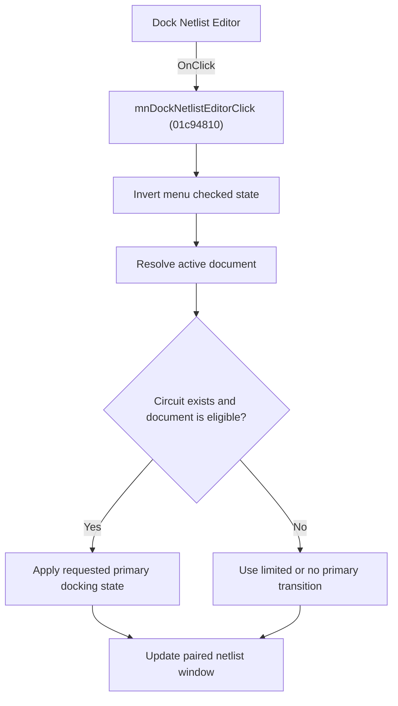

# D&ock Netlist Editor

> Analysis status: Source, graph, and state-branch review complete.

## Control

| Property | Recovered value |
| --- | --- |
| Form | SchematicEditor |
| Component path | SchematicEditor.MainMenu.mnTools.mnDockNetlistEditor |
| Control class | TMenuItem |
| Caption | D&ock Netlist Editor |
| Hint | Not present in the recovered resource. |
| Text | Not present in the recovered resource. |
| Handler name | mnDockNetlistEditorClick |
| Handler address | 01c94810 |
| Graph node | `resource:dfm:SchematicEditor/SchematicEditor.MainMenu.mnTools.mnDockNetlistEditor` |
| Handler node | `function:01c94810` |
| Graph layer | UI |

## What happens when clicked

The command toggles its own checked state and applies that state to the docked netlist tools. It gets the active Schematic Editor document and tests whether that document has a circuit object and whether the document's eligibility byte is set. The primary docking helper then docks, undocks, shows, or hides the shared netlist window and changes the main editor client visibility as necessary. A second helper updates the paired auxiliary netlist window.

If the shared netlist windows do not exist, the docking helpers make no window change. The menu check state still changes. When the command is turned on for an ineligible document, the recovered eligibility value prevents the full primary docking transition.

## Click flow

## Handler evidence

- Source: [DecompiledSources/Tina16/functions/0000000001C94810__FUN_01c94810.c](../../../DecompiledSources/Tina16/functions/0000000001C94810__FUN_01c94810.c)
- Recovered role: Toggles the docked netlist-editor windows for the active schematic document.
- Current graph summary: Inverts the menu check state, derives active-document eligibility, and updates the primary and paired netlist docking windows.
- Current graph behavior: The menu state always toggles. Window helpers are conditional on existing shared window objects and the active document state.
- Current graph evidence: `FUN_01c94810` calls the annotated menu checked-state setter with the inverse of offset `0x80`. It gets the active index from the editor collection at `+0x1350`, reads the selected item at `+0x2780`, and requires both object `+0x28` and byte `+0x978` for the full eligibility value. `FUN_01c8a4d0` contains the VCL visibility, reparenting, dock-position, and main-client branches; `FUN_01c8a7e0` updates the paired shared window.
- Complexity: complex
- Distinct outgoing calls: 5

## Direct calls

- `function:004aeac0` — FUN_004aeac0
- `function:006d5120` — FUN_006d5120
- `function:007e2d20` — FUN_007e2d20
- `function:01c8a4d0` — FUN_01c8a4d0
- `function:01c8a7e0` — FUN_01c8a7e0

## Resource evidence

- Kind: Not present in the recovered resource.
- Modal result: Not present in the recovered resource.
- Checked state: true
- List items: Not present in the recovered resource.
- Image reference: Not present in the recovered resource.
- Extracted glyph: None.

## Nearby label candidates

Nearby labels are layout candidates only. They are not proof of behavior.

- No same-parent label candidate is available.

## Analysis limits

- Delphi field names for the two shared netlist window pointers are not recovered.
- The menu item is checked in the resource. The source does not prove that both shared window objects already exist at form creation.

