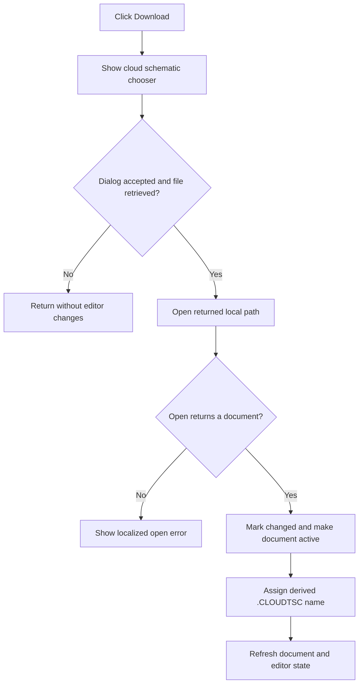

# Download...

> Analysis status: Reviewed from recovered cloud chooser, download, document-open, and editor-refresh paths.

## Control

| Property | Recovered value |
| --- | --- |
| Form | SchematicEditor |
| Component path | SchematicEditor.MainMenu.mnFile.mnCloud.mnDownloadFromCloud |
| Control class | TMenuItem |
| Caption | Download... |
| Hint | Not present in the recovered resource. |
| Text | Not present in the recovered resource. |
| Handler name | mnDownloadFromCloudClick |
| Handler address | 01c948a0 |
| Graph node | `resource:dfm:SchematicEditor/SchematicEditor.MainMenu.mnFile.mnCloud.mnDownloadFromCloud` |
| Handler node | `function:01c948a0` |
| Graph layer | UI |

## What happens when clicked

The handler asks the shared cloud service to select and retrieve a schematic. That worker checks the cloud session, shows the recovered cloud-item dialog, and proceeds only when the dialog returns result 1. It builds a request under `tina4web.dll/schematic?tsc=` and returns a local path only after the retrieved item produced a nonempty file name.

An empty returned path is a no-op. For a nonempty path, the handler opens the document. If the open routine returns zero, it formats and shows a localized error message. On success, it marks the returned document object as changed, makes it the active document, derives a `.CLOUDTSC` name, updates the document caption/path, and refreshes the editor and active view.

## Click flow

## Handler evidence

- Source: [DecompiledSources/Tina16/functions/0000000001C948A0__FUN_01c948a0.c](../../../DecompiledSources/Tina16/functions/0000000001C948A0__FUN_01c948a0.c)
- Recovered role: Retrieve a selected cloud schematic and open it in the Schematic Editor.
- Current graph summary: Handles 1 Delphi UI event: SchematicEditor.MainMenu.mnFile.mnCloud.mnDownloadFromCloud.OnClick.
- Current graph behavior: Gets a local path from the cloud chooser, opens it, reports an open failure, or activates and refreshes the opened cloud document.
- Current graph evidence: `FUN_014c4380` contains the accepted-dialog check and exact cloud download endpoint. `FUN_01c948a0` gates all editor changes on its nonempty output, checks the document-open return, builds `.CLOUDTSC`, updates active-document fields `+0x27a8` and `+0x2788`, and calls the editor refresh workers.
- Complexity: complex
- Distinct outgoing calls: 16

## Direct calls

- `function:00414480` — Delphi UnicodeString clear and finalization helper
- `function:00414560` — Delphi UnicodeString array finalization helper
- `function:00414b50` — FUN_00414b50
- `function:004414c0` — FUN_004414c0
- `function:00442f70` — FUN_00442f70
- `function:0065b870` — FUN_0065b870
- `function:00b89270` — FUN_00b89270
- `function:00b8e520` — FUN_00b8e520
- `function:014a1260` — FUN_014a1260
- `function:014a7fd0` — FUN_014a7fd0
- `function:014c0b50` — FUN_014c0b50
- `function:014c4380` — FUN_014c4380
- `function:016fd940` — FUN_016fd940
- `function:0199e310` — FUN_0199e310
- `function:01c7d780` — FUN_01c7d780
- `function:01c8ab30` — FUN_01c8ab30

## Resource evidence

- Kind: Not present in the recovered resource.
- Modal result: Not present in the recovered resource.
- Checked state: Not present in the recovered resource.
- List items: Not present in the recovered resource.
- Image reference: Not present in the recovered resource.
- Extracted glyph: None.

## Nearby label candidates

Nearby labels are layout candidates only. They are not proof of behavior.

- No same-parent label candidate is available.

## Analysis limits

- The localized open-error text is loaded by resource ID `0x593`; its final wording is not present in the recovered function.
- The recovered source does not expose the server's error payload or transport diagnostics.

