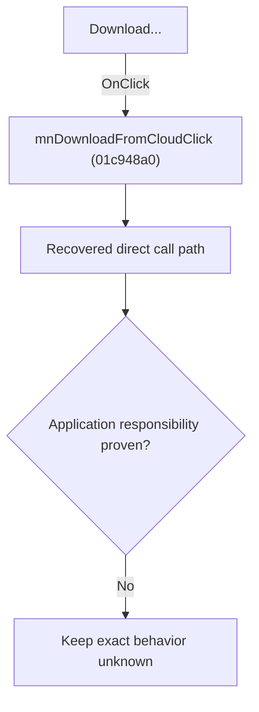

# Download...

> Analysis status: Blocked by an exact evidence gap.

## Control

| Property | Recovered value |
| --- | --- |
| Form | SchematicEditor |
| Component path | SchematicEditor.MainMenu.mnFile.mnCloud.mnDownloadFromCloud |
| Control class | TMenuItem |
| Caption | Download... |
| Hint | Not present in the recovered resource. |
| Text | Not present in the recovered resource. |
| Handler name | mnDownloadFromCloudClick |
| Handler address | 01c948a0 |
| Graph node | `resource:dfm:SchematicEditor/SchematicEditor.MainMenu.mnFile.mnCloud.mnDownloadFromCloud` |
| Handler node | `function:01c948a0` |
| Graph layer | UI |

## What happens when clicked

The OnClick binding reaches mnDownloadFromCloudClick at 01c948a0. The recovered body has 16 distinct outgoing graph call(s), but the application-specific responsibilities and data effects of its downstream path are not established in the accepted graph evidence. The control's caption or name indicates user intent only; it is not enough to claim implementation behavior.

## Click flow

## Handler evidence

- Source: [DecompiledSources/Tina16/functions/0000000001C948A0__FUN_01c948a0.c](../../../DecompiledSources/Tina16/functions/0000000001C948A0__FUN_01c948a0.c)
- Recovered role: Evidence-blocked mnDownloadFromCloudClick command.
- Current graph summary: Handles 1 Delphi UI event: SchematicEditor.MainMenu.mnFile.mnCloud.mnDownloadFromCloud.OnClick.
- Current graph behavior: The OnClick binding reaches mnDownloadFromCloudClick at 01c948a0. The recovered body has 16 distinct outgoing graph call(s), but the application-specific responsibilities and data effects of its downstream path are not established in the accepted graph evidence. The control's caption or name indicates user intent only; it is not enough to claim implementation behavior.
- Current graph evidence: The DFM binds SchematicEditor.MainMenu.mnFile.mnCloud.mnDownloadFromCloud to mnDownloadFromCloudClick. The recovered source is DecompiledSources/Tina16/functions/0000000001C948A0__FUN_01c948a0.c and directly references 00414480, 00414560, 00414b50, 004414c0, 00442f70, 0065b870, 00b89270, 00b8e520, and 8 more. No accepted end-to-end role was established for this control path.
- Complexity: complex
- Distinct outgoing calls: 16

## Direct calls

- `function:00414480` — Delphi UnicodeString clear and finalization helper
- `function:00414560` — Delphi UnicodeString array finalization helper
- `function:00414b50` — FUN_00414b50
- `function:004414c0` — FUN_004414c0
- `function:00442f70` — FUN_00442f70
- `function:0065b870` — FUN_0065b870
- `function:00b89270` — FUN_00b89270
- `function:00b8e520` — FUN_00b8e520
- `function:014a1260` — FUN_014a1260
- `function:014a7fd0` — FUN_014a7fd0
- `function:014c0b50` — FUN_014c0b50
- `function:014c4380` — FUN_014c4380
- `function:016fd940` — FUN_016fd940
- `function:0199e310` — FUN_0199e310
- `function:01c7d780` — FUN_01c7d780
- `function:01c8ab30` — FUN_01c8ab30

## Resource evidence

- Kind: Not present in the recovered resource.
- Modal result: Not present in the recovered resource.
- Checked state: Not present in the recovered resource.
- List items: Not present in the recovered resource.
- Image reference: Not present in the recovered resource.
- Extracted glyph: None.

## Nearby label candidates

Nearby labels are layout candidates only. They are not proof of behavior.

- No same-parent label candidate is available.

## Analysis limits

- Exact gap: the recovered handler or one of its direct application callees lacks a source-supported role that proves the command's decisions, state changes, and output. Keep this Bead open until those callees are traced.

