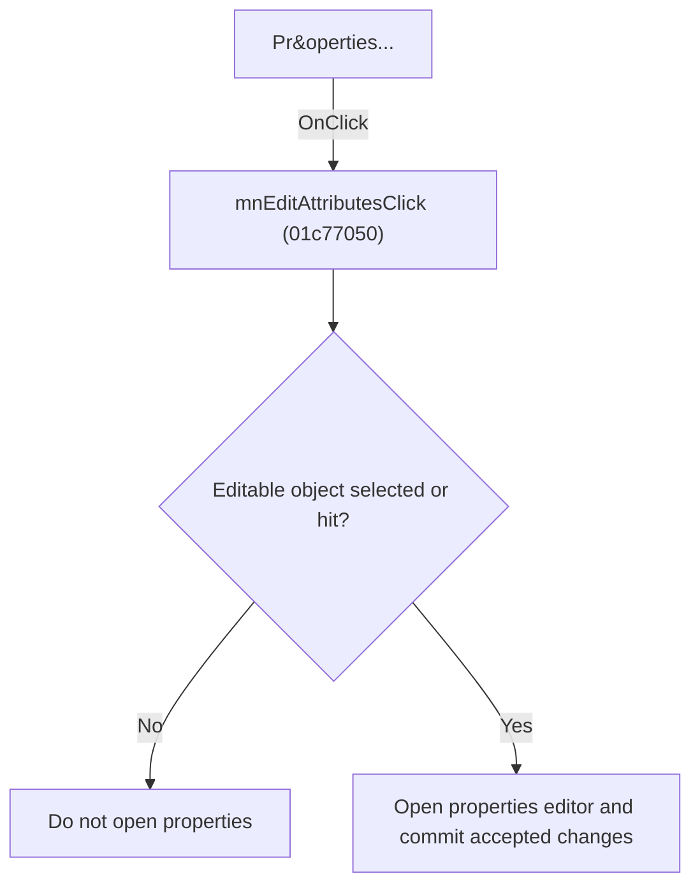

# Pr&operties...

> Analysis status: Individually reviewed.

## Control

| Property | Recovered value |
| --- | --- |
| Form | SchematicEditor |
| Component path | SchematicEditor.MainMenu.Edit.mnEditAttributes |
| Control class | TMenuItem |
| Caption | Pr&operties... |
| Hint | Not present in the recovered resource. |
| Text | Not present in the recovered resource. |
| Handler name | mnEditAttributesClick |
| Handler address | 01c77050 |
| Graph node | `resource:dfm:SchematicEditor/SchematicEditor.MainMenu.Edit.mnEditAttributes` |
| Handler node | `function:01c77050` |
| Graph layer | UI |

## What happens when clicked

The handler checks the editor mode and selection, finds the selected or hit-tested object, handles one special component path, opens the matching properties editor, and commits accepted changes. The UI Sender is non-null for both bound controls, so they follow the same branch.

## Click flow

## Handler evidence

- Source: [DecompiledSources/Tina16/functions/0000000001C77050__FUN_01c77050.c](../../../DecompiledSources/Tina16/functions/0000000001C77050__FUN_01c77050.c)
- Recovered role: Edit properties of the selected schematic object.
- Current graph summary: Handles 2 Delphi UI events: SchematicEditor.MainMenu.Edit.mnEditAttributes.OnClick, SchematicEditor.SchPopup.pmProperties.OnClick.
- Current graph behavior: The handler checks the editor mode and selection, finds the selected or hit-tested object, handles one special component path, opens the matching properties editor, and commits accepted changes. The UI Sender is non-null for both bound controls, so they follow the same branch.
- Current graph evidence: The recovered body contains mode and selection guards, selected-object lookup, a special class test, modal property-edit calls, accepted-result commit, and redraw paths. Both DFM controls pass non-null Sender values.
- Complexity: complex
- Distinct outgoing calls: 16

## Direct calls

- `function:00414480` — Delphi UnicodeString clear and finalization helper
- `function:0041ddd0` — FUN_0041ddd0
- `function:0064d3a0` — FUN_0064d3a0
- `function:00664d10` — FUN_00664d10
- `function:013b1c30` — FUN_013b1c30
- `function:017baeb0` — FUN_017baeb0
- `function:017baf00` — FUN_017baf00
- `function:017baf30` — FUN_017baf30
- `function:017baf50` — FUN_017baf50
- `function:0198a580` — FUN_0198a580
- `function:0198d430` — FUN_0198d430
- `function:01993ec0` — FUN_01993ec0
- `function:0199e310` — FUN_0199e310
- `function:01a982d0` — FUN_01a982d0
- `function:01c8cee0` — FUN_01c8cee0
- `function:01c8d130` — Handles 2 Delphi UI events: SchematicEditor.MainMenu.mnFile.mnOpenMacro.OnClick, SchematicEditor.SchPopup.pmOpenMacro.OnClick.

## Resource evidence

- Kind: Not present in the recovered resource.
- Modal result: Not present in the recovered resource.
- Checked state: Not present in the recovered resource.
- List items: Not present in the recovered resource.
- Image reference: Not present in the recovered resource.
- Extracted glyph: None.

## Nearby label candidates

Nearby labels are layout candidates only. They are not proof of behavior.

- No same-parent label candidate is available.

## Analysis limits

- The special component class name is not present in the recovered symbols.

