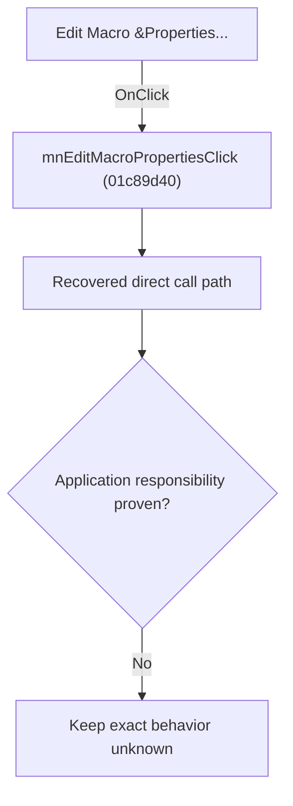

# Edit Macro &Properties...

> Analysis status: Blocked by an exact evidence gap.

## Control

| Property | Recovered value |
| --- | --- |
| Form | SchematicEditor |
| Component path | SchematicEditor.MainMenu.mnTools.mnEditMacroProperties |
| Control class | TMenuItem |
| Caption | Edit Macro &Properties... |
| Hint | Not present in the recovered resource. |
| Text | Not present in the recovered resource. |
| Handler name | mnEditMacroPropertiesClick |
| Handler address | 01c89d40 |
| Graph node | `resource:dfm:SchematicEditor/SchematicEditor.MainMenu.mnTools.mnEditMacroProperties` |
| Handler node | `function:01c89d40` |
| Graph layer | UI |

## What happens when clicked

The OnClick binding reaches mnEditMacroPropertiesClick at 01c89d40. The recovered body has 7 distinct outgoing graph call(s), but the application-specific responsibilities and data effects of its downstream path are not established in the accepted graph evidence. The control's caption or name indicates user intent only; it is not enough to claim implementation behavior.

## Click flow

## Handler evidence

- Source: [DecompiledSources/Tina16/functions/0000000001C89D40__FUN_01c89d40.c](../../../DecompiledSources/Tina16/functions/0000000001C89D40__FUN_01c89d40.c)
- Recovered role: Evidence-blocked mnEditMacroPropertiesClick command.
- Current graph summary: Handles 1 Delphi UI event: SchematicEditor.MainMenu.mnTools.mnEditMacroProperties.OnClick.
- Current graph behavior: The OnClick binding reaches mnEditMacroPropertiesClick at 01c89d40. The recovered body has 7 distinct outgoing graph call(s), but the application-specific responsibilities and data effects of its downstream path are not established in the accepted graph evidence. The control's caption or name indicates user intent only; it is not enough to claim implementation behavior.
- Current graph evidence: The DFM binds SchematicEditor.MainMenu.mnTools.mnEditMacroProperties to mnEditMacroPropertiesClick. The recovered source is DecompiledSources/Tina16/functions/0000000001C89D40__FUN_01c89d40.c and directly references 00410f20, 0198a580, 01993ec0, 0199e310, 01b921c0, 01c8cee0, 01d04d40. No accepted end-to-end role was established for this control path.
- Complexity: complex
- Distinct outgoing calls: 7

## Direct calls

- `function:00410f20` — Nil-safe Delphi object destruction helper
- `function:0198a580` — FUN_0198a580
- `function:01993ec0` — FUN_01993ec0
- `function:0199e310` — FUN_0199e310
- `function:01b921c0` — FUN_01b921c0
- `function:01c8cee0` — FUN_01c8cee0
- `function:01d04d40` — FUN_01d04d40

## Resource evidence

- Kind: Not present in the recovered resource.
- Modal result: Not present in the recovered resource.
- Checked state: Not present in the recovered resource.
- List items: Not present in the recovered resource.
- Image reference: Not present in the recovered resource.
- Extracted glyph: None.

## Nearby label candidates

Nearby labels are layout candidates only. They are not proof of behavior.

- No same-parent label candidate is available.

## Analysis limits

- Exact gap: the recovered handler or one of its direct application callees lacks a source-supported role that proves the command's decisions, state changes, and output. Keep this Bead open until those callees are traced.

