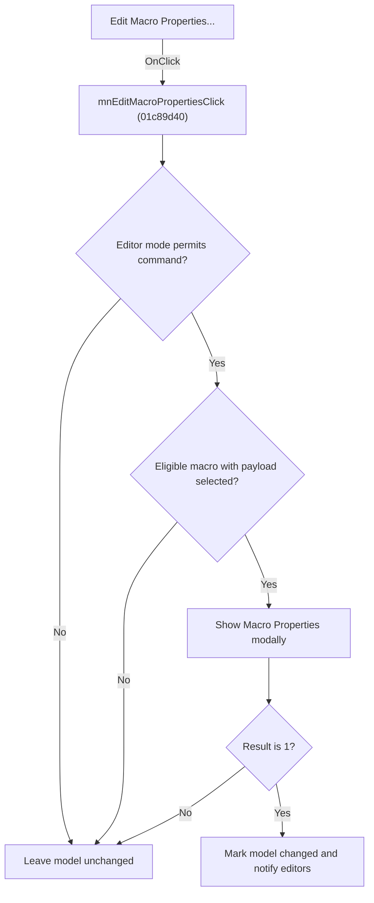

# Edit Macro &Properties...

> Analysis status: Source, graph, and dialog evidence reviewed.

## Control

| Property | Recovered value |
| --- | --- |
| Form | SchematicEditor |
| Component path | SchematicEditor.MainMenu.mnTools.mnEditMacroProperties |
| Control class | TMenuItem |
| Caption | Edit Macro &Properties... |
| Hint | Not present in the recovered resource. |
| Text | Not present in the recovered resource. |
| Handler name | mnEditMacroPropertiesClick |
| Handler address | 01c89d40 |
| Graph node | `resource:dfm:SchematicEditor/SchematicEditor.MainMenu.mnTools.mnEditMacroProperties` |
| Handler node | `function:01c89d40` |
| Graph layer | UI |

## What happens when clicked

The command opens `MacroPropertiesForm` only for an eligible selected macro. It first rejects disallowed editor modes. It then finds the selected component in the current model and requires all of these conditions: the selection exists, the application is not in the recovered global lock state, the selected component has macro type `4`, and it has an attached macro payload at offset `0x1A8`.

For an eligible macro, the handler constructs `MacroPropertiesForm` with the selected component and payload and shows it modally. If the result is `1`, it marks the current model changed and notifies dependent editor windows. Cancel, an ineligible selection, or a missing payload causes no model update.

## Click flow

## Handler evidence

- Source: [DecompiledSources/Tina16/functions/0000000001C89D40__FUN_01c89d40.c](../../../DecompiledSources/Tina16/functions/0000000001C89D40__FUN_01c89d40.c)
- Recovered role: Edits the selected macro payload and notifies the model after acceptance.
- Current graph summary: Applies selection and mode guards, shows `MacroPropertiesForm`, and sends a model-change notification only for modal result `1`.
- Current graph behavior: Cancel and every failed eligibility check are no-op paths for the model.
- Current graph evidence: `FUN_01993ec0` finds the selected model item. `FUN_0198a580` must return type `4`, and `FUN_01d04d40` requires payload offset `0x1A8`. `FUN_01b921c0` stores the selected component and payload in the recovered `TMacroPropertiesForm`. The accepted branch calls `FUN_0199e310(model,0,1,0)`.
- Complexity: complex
- Distinct outgoing calls: 7

## Direct calls

- `function:00410f20` — Nil-safe Delphi object destruction helper
- `function:0198a580` — FUN_0198a580
- `function:01993ec0` — FUN_01993ec0
- `function:0199e310` — FUN_0199e310
- `function:01b921c0` — FUN_01b921c0
- `function:01c8cee0` — FUN_01c8cee0
- `function:01d04d40` — FUN_01d04d40

## Resource evidence

- Kind: Not present in the recovered resource.
- Modal result: Not present in the recovered resource.
- Checked state: Not present in the recovered resource.
- List items: Not present in the recovered resource.
- Image reference: Not present in the recovered resource.
- Extracted glyph: None.

## Nearby label candidates

Nearby labels are layout candidates only. They are not proof of behavior.

- No same-parent label candidate is available.

## Analysis limits

- The global lock byte and the editor-mode fields do not have recovered Delphi names.
- The modal form owns validation of individual macro fields. The outer handler receives only the modal result.

