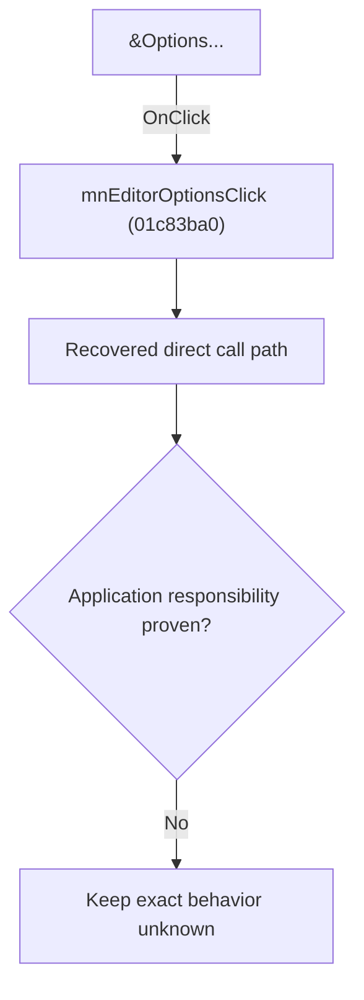

# &Options...

> Analysis status: Blocked by an exact evidence gap.

## Control

| Property | Recovered value |
| --- | --- |
| Form | SchematicEditor |
| Component path | SchematicEditor.MainMenu.View.mnEditorOptions |
| Control class | TMenuItem |
| Caption | &Options... |
| Hint | Not present in the recovered resource. |
| Text | Not present in the recovered resource. |
| Handler name | mnEditorOptionsClick |
| Handler address | 01c83ba0 |
| Graph node | `resource:dfm:SchematicEditor/SchematicEditor.MainMenu.View.mnEditorOptions` |
| Handler node | `function:01c83ba0` |
| Graph layer | UI |

## What happens when clicked

The OnClick binding reaches mnEditorOptionsClick at 01c83ba0. The recovered body has 11 distinct outgoing graph call(s), but the application-specific responsibilities and data effects of its downstream path are not established in the accepted graph evidence. The control's caption or name indicates user intent only; it is not enough to claim implementation behavior.

## Click flow

## Handler evidence

- Source: [DecompiledSources/Tina16/functions/0000000001C83BA0__FUN_01c83ba0.c](../../../DecompiledSources/Tina16/functions/0000000001C83BA0__FUN_01c83ba0.c)
- Recovered role: Evidence-blocked mnEditorOptionsClick command.
- Current graph summary: Handles 1 Delphi UI event: SchematicEditor.MainMenu.View.mnEditorOptions.OnClick.
- Current graph behavior: The OnClick binding reaches mnEditorOptionsClick at 01c83ba0. The recovered body has 11 distinct outgoing graph call(s), but the application-specific responsibilities and data effects of its downstream path are not established in the accepted graph evidence. The control's caption or name indicates user intent only; it is not enough to claim implementation behavior.
- Current graph evidence: The DFM binds SchematicEditor.MainMenu.View.mnEditorOptions to mnEditorOptionsClick. The recovered source is DecompiledSources/Tina16/functions/0000000001C83BA0__FUN_01c83ba0.c and directly references 00410f20, 00414480, 00414b50, 00416db0, 0064e030, 0064e770, 00f833f0, 00f834f0, and 3 more. No accepted end-to-end role was established for this control path.
- Complexity: complex
- Distinct outgoing calls: 11

## Direct calls

- `function:00410f20` — Nil-safe Delphi object destruction helper
- `function:00414480` — Delphi UnicodeString clear and finalization helper
- `function:00414b50` — FUN_00414b50
- `function:00416db0` — FUN_00416db0
- `function:0064e030` — FUN_0064e030
- `function:0064e770` — FUN_0064e770
- `function:00f833f0` — FUN_00f833f0
- `function:00f834f0` — FUN_00f834f0
- `function:01a77ef0` — Handles 1 Delphi UI event: DFWindow.OnPaint.
- `function:01b7a760` — FUN_01b7a760
- `function:01c835b0` — FUN_01c835b0

## Resource evidence

- Kind: Not present in the recovered resource.
- Modal result: Not present in the recovered resource.
- Checked state: Not present in the recovered resource.
- List items: Not present in the recovered resource.
- Image reference: Not present in the recovered resource.
- Extracted glyph: None.

## Nearby label candidates

Nearby labels are layout candidates only. They are not proof of behavior.

- No same-parent label candidate is available.

## Analysis limits

- Exact gap: the recovered handler or one of its direct application callees lacks a source-supported role that proves the command's decisions, state changes, and output. Keep this Bead open until those callees are traced.

