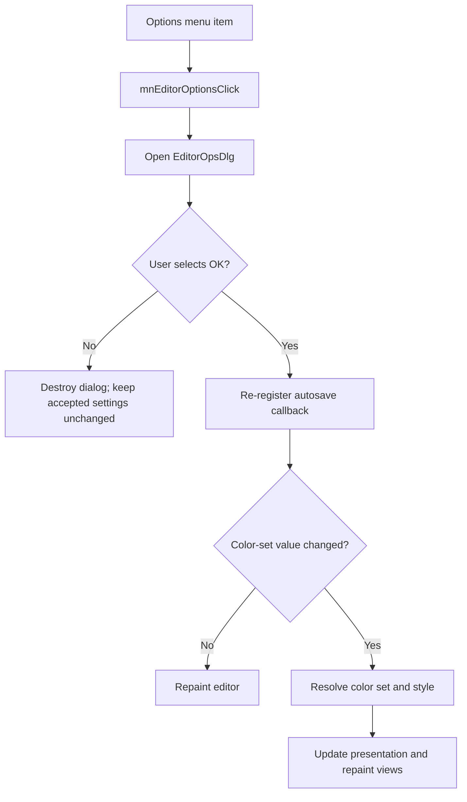

# &Options...

> Analysis status: Reviewed with recovered modal, autosave, style, and repaint evidence.

## Control

| Property | Recovered value |
| --- | --- |
| Component path | `SchematicEditor.MainMenu.View.mnEditorOptions` |
| Control class | `TMenuItem` |
| Handler | `mnEditorOptionsClick` at `01c83ba0` |

## What happens when clicked

The command saves the current schematic color-set value and opens `EditorOpsDlg` with the schematic editor as its owner. Cancel destroys the dialog and makes no accepted-option update. After OK, the handler re-registers the recovered autosave callback with the configured interval. It then compares the old and new color-set values. An unchanged value repaints the editor. A changed value resolves the new color set and style, updates the editor presentation when required, repaints the schematic views, and asks the active design window to refresh.

## Click flow

## Evidence

- [Handler source](../../../DecompiledSources/Tina16/functions/0000000001C83BA0__FUN_01c83ba0.c) contains the modal-result branch, callback registration, value comparison, style path, and repaint calls.
- [Dialog constructor](../../../DecompiledSources/Tina16/functions/0000000001B7A760__FUN_01b7a760.c) stores the schematic editor owner at dialog offset `0x808`.
- [Autosave callback](../../../DecompiledSources/Tina16/functions/0000000001CA0510__FUN_01ca0510.c) performs the recovered scheduled autosave work and requeues itself.
- [Color-set resolver](../../../DecompiledSources/Tina16/functions/0000000001C835B0__FUN_01c835b0.c) reads the named schematic color set from `TINA.INI` and applies the related VCL style when required.

## Analysis limits

- The recovered dialog code does not expose every option field changed by the user.
