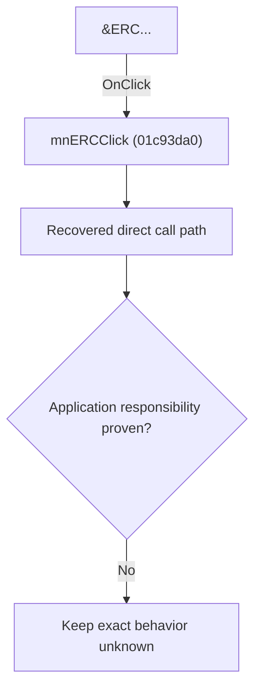

# &ERC...

> Analysis status: Blocked by an exact evidence gap.

## Control

| Property | Recovered value |
| --- | --- |
| Form | SchematicEditor |
| Component path | SchematicEditor.MainMenu.mnAnalysis.mnERC |
| Control class | TMenuItem |
| Caption | &ERC... |
| Hint | Not present in the recovered resource. |
| Text | Not present in the recovered resource. |
| Handler name | mnERCClick |
| Handler address | 01c93da0 |
| Graph node | `resource:dfm:SchematicEditor/SchematicEditor.MainMenu.mnAnalysis.mnERC` |
| Handler node | `function:01c93da0` |
| Graph layer | UI |

## What happens when clicked

The OnClick binding reaches mnERCClick at 01c93da0. The recovered body has 4 distinct outgoing graph call(s), but the application-specific responsibilities and data effects of its downstream path are not established in the accepted graph evidence. The control's caption or name indicates user intent only; it is not enough to claim implementation behavior.

## Click flow

## Handler evidence

- Source: [DecompiledSources/Tina16/functions/0000000001C93DA0__FUN_01c93da0.c](../../../DecompiledSources/Tina16/functions/0000000001C93DA0__FUN_01c93da0.c)
- Recovered role: Evidence-blocked mnERCClick command.
- Current graph summary: Handles 1 Delphi UI event: SchematicEditor.MainMenu.mnAnalysis.mnERC.OnClick.
- Current graph behavior: The OnClick binding reaches mnERCClick at 01c93da0. The recovered body has 4 distinct outgoing graph call(s), but the application-specific responsibilities and data effects of its downstream path are not established in the accepted graph evidence. The control's caption or name indicates user intent only; it is not enough to claim implementation behavior.
- Current graph evidence: The DFM binds SchematicEditor.MainMenu.mnAnalysis.mnERC to mnERCClick. The recovered source is DecompiledSources/Tina16/functions/0000000001C93DA0__FUN_01c93da0.c and directly references 0064e1d0, 007fc180, 008059a0, 014b7800. No accepted end-to-end role was established for this control path.
- Complexity: complex
- Distinct outgoing calls: 4

## Direct calls

- `function:0064e1d0` — FUN_0064e1d0
- `function:007fc180` — FUN_007fc180
- `function:008059a0` — FUN_008059a0
- `function:014b7800` — Handles 1 Delphi UI event: ERCForm.btnCheck.OnClick.

## Resource evidence

- Kind: Not present in the recovered resource.
- Modal result: Not present in the recovered resource.
- Checked state: Not present in the recovered resource.
- List items: Not present in the recovered resource.
- Image reference: Not present in the recovered resource.
- Extracted glyph: None.

## Nearby label candidates

Nearby labels are layout candidates only. They are not proof of behavior.

- No same-parent label candidate is available.

## Analysis limits

- Exact gap: the recovered handler or one of its direct application callees lacks a source-supported role that proves the command's decisions, state changes, and output. Keep this Bead open until those callees are traced.

