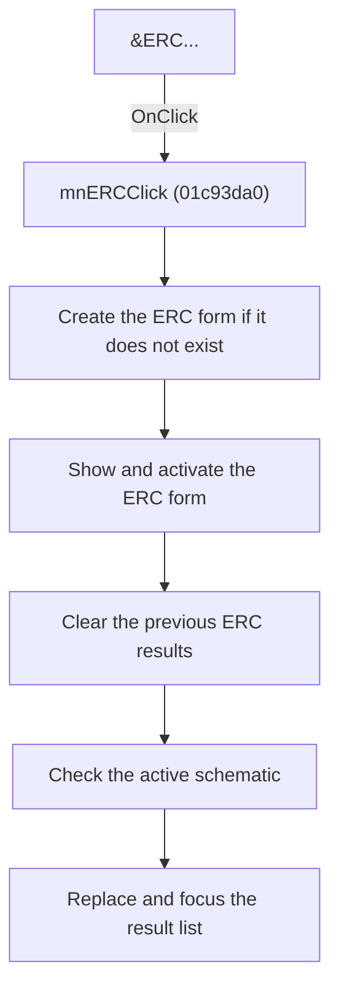

# ERC

> Analysis status: Reviewed from recovered source and graph evidence.

## Control

| Property | Recovered value |
| --- | --- |
| Form | SchematicEditor |
| Component path | SchematicEditor.MainMenu.mnAnalysis.mnERC |
| Control class | TMenuItem |
| Caption | &ERC... |
| Handler name | mnERCClick |
| Handler address | 01c93da0 |
| Graph node | `resource:dfm:SchematicEditor/SchematicEditor.MainMenu.mnAnalysis.mnERC` |
| Handler node | `function:01c93da0` |
| Graph layer | UI |

## What happens when clicked

Creates the ERC form when necessary, shows and activates it, clears the old result rows, runs the electrical-rules check for the active schematic, and replaces the result list.

## Click flow

## Handler evidence

- Source: [DecompiledSources/Tina16/functions/0000000001C93DA0__FUN_01c93da0.c](../../../DecompiledSources/Tina16/functions/0000000001C93DA0__FUN_01c93da0.c)
- Recovered role: Open the ERC window and run a new check.
- Evidence: The handler lazily creates the form at PTR_DAT_02001e80, shows it through FUN_008059a0, activates it through FUN_0064e1d0, and calls FUN_014b7800. The accepted 014b7800 and 014b7750 annotations prove mode 0x0f re-check, active-schematic resolution, prior-result clearing, rule execution, result-list replacement, focus, and issue-navigation instruction display.

## Application-relevant calls

- FUN_014b7800 starts the re-check; FUN_014b7750 coordinates rule execution and result presentation.

## Resource evidence

- The DFM binds this menu item to `mnERCClick`.
- The recovered caption is `&ERC...`.
- No extracted glyph is associated with this control.

## Analysis limits

- The recovered names of some form fields and global state bytes are not available. This article identifies them by stable offsets and proven readers or writers where necessary.