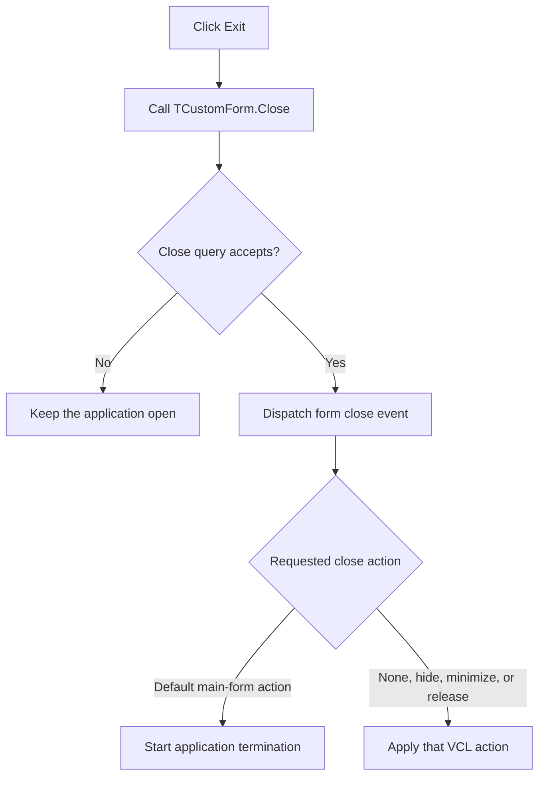

# E&xit

> Analysis status: Reviewed from the recovered VCL form-close pipeline.

## Control

| Property | Recovered value |
| --- | --- |
| Form | SchematicEditor |
| Component path | SchematicEditor.MainMenu.mnFile.mnExit |
| Control class | TMenuItem |
| Caption | E&xit |
| Hint | Not present in the recovered resource. |
| Text | Not present in the recovered resource. |
| Handler name | mnExitClick |
| Handler address | 01c76b90 |
| Graph node | `resource:dfm:SchematicEditor/SchematicEditor.MainMenu.mnFile.mnExit` |
| Handler node | `function:01c76b90` |
| Graph layer | UI |

## What happens when clicked

The click wrapper calls the VCL form `Close` routine and does no other work. For this modeless main form, VCL first runs the form's close-query method. A rejected close query leaves the application open. An accepted query dispatches the form close event and follows its requested action. If the action is the default action for the application main form, VCL starts application termination.

Unsaved-document prompts and shutdown cleanup therefore belong to the form's close-query and close-event paths, not to this menu handler. A modal form would receive `mrCancel`, but this Schematic Editor command operates on the main form.

## Click flow

## Handler evidence

- Source: [DecompiledSources/Tina16/functions/0000000001C76B90__FUN_01c76b90.c](../../../DecompiledSources/Tina16/functions/0000000001C76B90__FUN_01c76b90.c)
- Recovered role: Request closure of the Schematic Editor main form.
- Current graph summary: Handles 1 Delphi UI event: SchematicEditor.MainMenu.mnFile.mnExit.OnClick.
- Current graph behavior: Delegates the request to the standard VCL close-query and close-action pipeline.
- Current graph evidence: `FUN_01c76b90` calls only `FUN_00805200`. The accepted annotation for that shared VCL routine identifies it as `TCustomForm.Close` and documents its close-query, event, and action dispatch.
- Complexity: simple
- Distinct outgoing calls: 1

## Direct calls

- `function:00805200` — FUN_00805200

## Resource evidence

- Kind: Not present in the recovered resource.
- Modal result: Not present in the recovered resource.
- Checked state: Not present in the recovered resource.
- List items: Not present in the recovered resource.
- Image reference: Not present in the recovered resource.
- Extracted glyph: None.

## Nearby label candidates

Nearby labels are layout candidates only. They are not proof of behavior.

- No same-parent label candidate is available.

## Analysis limits

- This wrapper does not identify which document can reject shutdown or which shutdown prompt text is shown. Those details are in the form lifecycle handlers.

