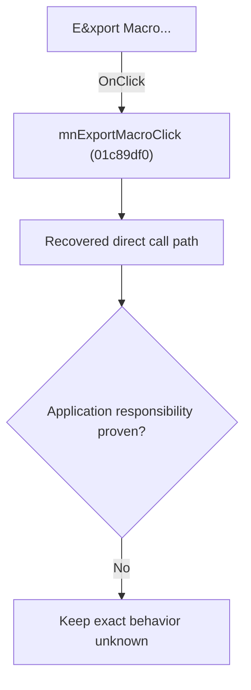

# E&xport Macro...

> Analysis status: Blocked by an exact evidence gap.

## Control

| Property | Recovered value |
| --- | --- |
| Form | SchematicEditor |
| Component path | SchematicEditor.MainMenu.mnTools.mnExportMacro |
| Control class | TMenuItem |
| Caption | E&xport Macro... |
| Hint | Not present in the recovered resource. |
| Text | Not present in the recovered resource. |
| Handler name | mnExportMacroClick |
| Handler address | 01c89df0 |
| Graph node | `resource:dfm:SchematicEditor/SchematicEditor.MainMenu.mnTools.mnExportMacro` |
| Handler node | `function:01c89df0` |
| Graph layer | UI |

## What happens when clicked

The OnClick binding reaches mnExportMacroClick at 01c89df0. The recovered body has 7 distinct outgoing graph call(s), but the application-specific responsibilities and data effects of its downstream path are not established in the accepted graph evidence. The control's caption or name indicates user intent only; it is not enough to claim implementation behavior.

## Click flow

## Handler evidence

- Source: [DecompiledSources/Tina16/functions/0000000001C89DF0__FUN_01c89df0.c](../../../DecompiledSources/Tina16/functions/0000000001C89DF0__FUN_01c89df0.c)
- Recovered role: Evidence-blocked mnExportMacroClick command.
- Current graph summary: Handles 1 Delphi UI event: SchematicEditor.MainMenu.mnTools.mnExportMacro.OnClick.
- Current graph behavior: The OnClick binding reaches mnExportMacroClick at 01c89df0. The recovered body has 7 distinct outgoing graph call(s), but the application-specific responsibilities and data effects of its downstream path are not established in the accepted graph evidence. The control's caption or name indicates user intent only; it is not enough to claim implementation behavior.
- Current graph evidence: The DFM binds SchematicEditor.MainMenu.mnTools.mnExportMacro to mnExportMacroClick. The recovered source is DecompiledSources/Tina16/functions/0000000001C89DF0__FUN_01c89df0.c and directly references 00414560, 00724270, 00724300, 01440040, 0176cff0, 01993ec0, 01d04d40. No accepted end-to-end role was established for this control path.
- Complexity: complex
- Distinct outgoing calls: 7

## Direct calls

- `function:00414560` — Delphi UnicodeString array finalization helper
- `function:00724270` — FUN_00724270
- `function:00724300` — FUN_00724300
- `function:01440040` — FUN_01440040
- `function:0176cff0` — FUN_0176cff0
- `function:01993ec0` — FUN_01993ec0
- `function:01d04d40` — FUN_01d04d40

## Resource evidence

- Kind: Not present in the recovered resource.
- Modal result: Not present in the recovered resource.
- Checked state: Not present in the recovered resource.
- List items: Not present in the recovered resource.
- Image reference: Not present in the recovered resource.
- Extracted glyph: None.

## Nearby label candidates

Nearby labels are layout candidates only. They are not proof of behavior.

- No same-parent label candidate is available.

## Analysis limits

- Exact gap: the recovered handler or one of its direct application callees lacks a source-supported role that proves the command's decisions, state changes, and output. Keep this Bead open until those callees are traced.

