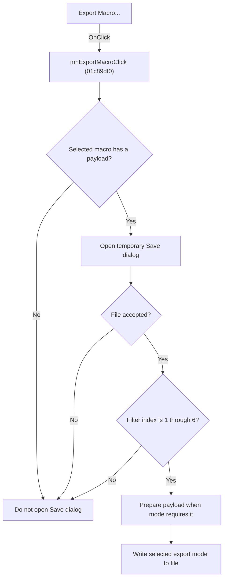

# E&xport Macro...

> Analysis status: Source and file-dialog branch review complete.

## Control

| Property | Recovered value |
| --- | --- |
| Form | SchematicEditor |
| Component path | SchematicEditor.MainMenu.mnTools.mnExportMacro |
| Control class | TMenuItem |
| Caption | E&xport Macro... |
| Hint | Not present in the recovered resource. |
| Text | Not present in the recovered resource. |
| Handler name | mnExportMacroClick |
| Handler address | 01c89df0 |
| Graph node | `resource:dfm:SchematicEditor/SchematicEditor.MainMenu.mnTools.mnExportMacro` |
| Handler node | `function:01c89df0` |
| Graph layer | UI |

## What happens when clicked

The command exports the payload of the selected macro. It finds the selected model item and requires an attached payload at offset `0x1A8`. If there is no selected item or payload, the command returns without opening a dialog.

For an eligible macro, the handler opens the Schematic Editor temporary Save dialog. Cancel causes no export. On acceptance, the dialog filter index selects one of six payload-writer modes, numbered `0` through `5`. Filter indexes `2` and `3` first prepare an attached subobject when the payload state requires it. The handler then passes the selected file name, the zero-based mode, and the shared export option to the payload's virtual writer. An unexpected filter index outside `1` through `6` performs no writer call.

## Click flow

## Handler evidence

- Source: [DecompiledSources/Tina16/functions/0000000001C89DF0__FUN_01c89df0.c](../../../DecompiledSources/Tina16/functions/0000000001C89DF0__FUN_01c89df0.c)
- Recovered role: Exports the selected macro payload through one of six file-writer modes.
- Current graph summary: Applies selection and payload guards, opens a Save dialog, maps filter indexes `1` through `6` to writer modes `0` through `5`, and writes the selected file.
- Current graph behavior: Cancel, a missing selection or payload, and an out-of-range filter index are no-export paths.
- Current graph evidence: `FUN_01993ec0` resolves the selected item and `FUN_01d04d40` checks payload `+0x1A8`. The handler executes the dialog at editor `+0x1910`, reads its filter index six times, gets the selected file with `FUN_00724270`, and calls the payload virtual method at slot `+0x30` with modes `0` through `5`. Modes `1` and `2` in zero-based form use `FUN_01440040` on the attached subobject when the recovered payload-state checks pass.
- Complexity: complex
- Distinct outgoing calls: 7

## Direct calls

- `function:00414560` — Delphi UnicodeString array finalization helper
- `function:00724270` — FUN_00724270
- `function:00724300` — FUN_00724300
- `function:01440040` — FUN_01440040
- `function:0176cff0` — FUN_0176cff0
- `function:01993ec0` — FUN_01993ec0
- `function:01d04d40` — FUN_01d04d40

## Resource evidence

- Kind: Not present in the recovered resource.
- Modal result: Not present in the recovered resource.
- Checked state: Not present in the recovered resource.
- List items: Not present in the recovered resource.
- Image reference: Not present in the recovered resource.
- Extracted glyph: None.

## Nearby label candidates

Nearby labels are layout candidates only. They are not proof of behavior.

- No same-parent label candidate is available.

## Analysis limits

- The six filter labels are not present in the extracted DFM evidence, so this article does not invent file-format names.
- The virtual writer's internal error handling is outside the recovered handler path.

