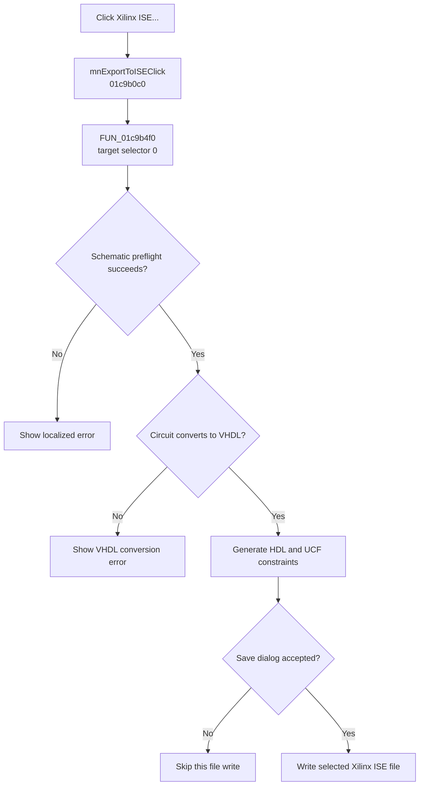

# Xilinx ISE...

> Analysis status: Evidence-backed source review complete.

## Control

| Property | Recovered value |
| --- | --- |
| Form | SchematicEditor |
| Component path | SchematicEditor.MainMenu.mnTM.DownloadtoFPGACard1.mnExportToISE |
| Control class | TMenuItem |
| Caption | Xilinx ISE... |
| Hint | Not present in the recovered resource. |
| Text | Not present in the recovered resource. |
| Handler name | mnExportToISEClick |
| Handler address | 01c9b0c0 |
| Graph node | `resource:dfm:SchematicEditor/SchematicEditor.MainMenu.mnTM.DownloadtoFPGACard1.mnExportToISE` |
| Handler node | `function:01c9b0c0` |
| Graph layer | UI |

## What happens when clicked

`mnExportToISEClick` calls [`FUN_01c9b4f0`](../../../DecompiledSources/Tina16/functions/0000000001C9B4F0__FUN_01c9b4f0.c) with target selector `0`. The common export routine first runs the recovered schematic processing and ERC path. A failed preflight shows a localized error and stops this export. It then requires the current circuit to convert to VHDL; otherwise, it shows **Can't convert to VHDL!**.

The accepted path builds the VHDL conversion model and prepares generated HDL and package files. [`FUN_01561f80`](../../../DecompiledSources/Tina16/functions/0000000001561F80__FUN_01561f80.c) uses selector `0` to generate Xilinx ISE pin constraints in UCF syntax. It checks whether the selected FPGA device family matches the requested vendor and reports a target mismatch, mixed-device pins, missing device data, or constraint-generation errors. The routine selects the `UCF File|*.ucf` save filter. If the user accepts the save dialog, it writes the generated constraint list to the selected path. A canceled save skips that file write.

The export can ask for more than one generated HDL or constraint file. It is not transactional: cancellation or a later error does not roll back files that an earlier accepted save already wrote. The routine releases its conversion objects and restores temporary compiler state before it returns.

## Click flow

## Handler evidence

- Source: [DecompiledSources/Tina16/functions/0000000001C9B0C0__FUN_01c9b0c0.c](../../../DecompiledSources/Tina16/functions/0000000001C9B0C0__FUN_01c9b0c0.c)
- Recovered role: Convert the current circuit and export Xilinx ISE HDL constraints.
- Current graph summary: Handles 1 Delphi UI event: SchematicEditor.MainMenu.mnTM.DownloadtoFPGACard1.mnExportToISE.OnClick.
- Current graph behavior: Passes target selector 0 to the common FPGA export routine, which runs schematic checks, converts to VHDL, generates UCF constraints, and writes accepted save-dialog outputs.
- Current graph evidence: The DFM binds SchematicEditor.MainMenu.mnTM.DownloadtoFPGACard1.mnExportToISE to mnExportToISEClick. The wrapper passes selector 0; FUN_01c9b4f0 selects filter UCF File|*.ucf, and FUN_01561f80 emits Xilinx ISE constraint syntax and target-family checks.
- Complexity: simple
- Distinct outgoing calls: 1

## Direct calls

- `function:01c9b4f0` — [FUN_01c9b4f0](../../../DecompiledSources/Tina16/functions/0000000001C9B4F0__FUN_01c9b4f0.c), the common VHDL and FPGA constraint export workflow.
- `function:01561f80` — [FUN_01561f80](../../../DecompiledSources/Tina16/functions/0000000001561F80__FUN_01561f80.c), the target-specific constraint generator.

## Resource evidence

- Kind: Not present in the recovered resource.
- Modal result: Not present in the recovered resource.
- Checked state: Not present in the recovered resource.
- List items: Not present in the recovered resource.
- Image reference: Not present in the recovered resource.
- Extracted glyph: None.

## Nearby label candidates

Nearby labels are layout candidates only. They are not proof of behavior.

- No same-parent label candidate is available.

## Analysis limits

- The original Delphi enumeration name for selector `0` is not recovered. Its target is proven by the UCF extension, save filter, emitted syntax, and parallel menu selectors.
- The recovered path proves local file generation. It does not invoke the external Xilinx ISE tool or prove that the generated project builds successfully in that tool.

