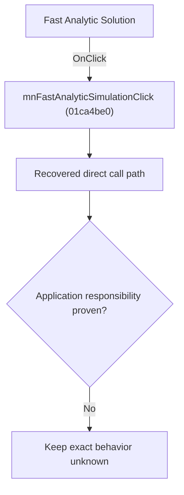

# Fast Analytic Solution

> Analysis status: Blocked by an exact evidence gap.

## Control

| Property | Recovered value |
| --- | --- |
| Form | SchematicEditor |
| Component path | SchematicEditor.MainMenu.mnAnalysis.mnFastAnalyticSimulation |
| Control class | TMenuItem |
| Caption | Fast Analytic Solution |
| Hint | Not present in the recovered resource. |
| Text | Not present in the recovered resource. |
| Handler name | mnFastAnalyticSimulationClick |
| Handler address | 01ca4be0 |
| Graph node | `resource:dfm:SchematicEditor/SchematicEditor.MainMenu.mnAnalysis.mnFastAnalyticSimulation` |
| Handler node | `function:01ca4be0` |
| Graph layer | UI |

## What happens when clicked

The OnClick binding reaches mnFastAnalyticSimulationClick at 01ca4be0. The recovered body has 10 distinct outgoing graph call(s), but the application-specific responsibilities and data effects of its downstream path are not established in the accepted graph evidence. The control's caption or name indicates user intent only; it is not enough to claim implementation behavior.

## Click flow

## Handler evidence

- Source: [DecompiledSources/Tina16/functions/0000000001CA4BE0__FUN_01ca4be0.c](../../../DecompiledSources/Tina16/functions/0000000001CA4BE0__FUN_01ca4be0.c)
- Recovered role: Evidence-blocked mnFastAnalyticSimulationClick command.
- Current graph summary: Handles 1 Delphi UI event: SchematicEditor.MainMenu.mnAnalysis.mnFastAnalyticSimulation.OnClick.
- Current graph behavior: The OnClick binding reaches mnFastAnalyticSimulationClick at 01ca4be0. The recovered body has 10 distinct outgoing graph call(s), but the application-specific responsibilities and data effects of its downstream path are not established in the accepted graph evidence. The control's caption or name indicates user intent only; it is not enough to claim implementation behavior.
- Current graph evidence: The DFM binds SchematicEditor.MainMenu.mnAnalysis.mnFastAnalyticSimulation to mnFastAnalyticSimulationClick. The recovered source is DecompiledSources/Tina16/functions/0000000001CA4BE0__FUN_01ca4be0.c and directly references 00410e60, 00410f20, 00414480, 00414560, 01477340, 01477fa0, 01478130, 01478670, and 2 more. No accepted end-to-end role was established for this control path.
- Complexity: complex
- Distinct outgoing calls: 10

## Direct calls

- `function:00410e60` — FUN_00410e60
- `function:00410f20` — Nil-safe Delphi object destruction helper
- `function:00414480` — Delphi UnicodeString clear and finalization helper
- `function:00414560` — Delphi UnicodeString array finalization helper
- `function:01477340` — FUN_01477340
- `function:01477fa0` — FUN_01477fa0
- `function:01478130` — FUN_01478130
- `function:01478670` — FUN_01478670
- `function:019a4600` — FUN_019a4600
- `function:01c76fd0` — Handles 1 Delphi UI event: SchematicEditor.MainMenu.View.mnRedraw.OnClick.

## Resource evidence

- Kind: Not present in the recovered resource.
- Modal result: Not present in the recovered resource.
- Checked state: Not present in the recovered resource.
- List items: Not present in the recovered resource.
- Image reference: Not present in the recovered resource.
- Extracted glyph: None.

## Nearby label candidates

Nearby labels are layout candidates only. They are not proof of behavior.

- No same-parent label candidate is available.

## Analysis limits

- Exact gap: the recovered handler or one of its direct application callees lacks a source-supported role that proves the command's decisions, state changes, and output. Keep this Bead open until those callees are traced.

