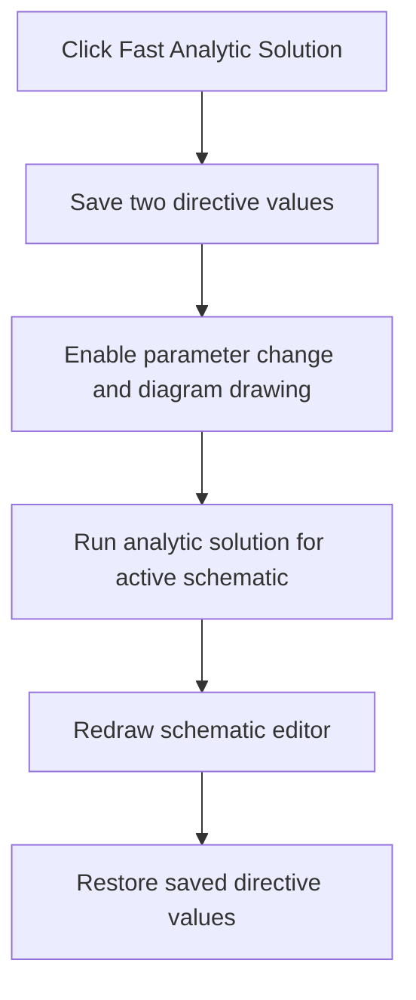

# Fast Analytic Solution

> Analysis status: Reviewed from the directive-state, analytic-runner, and redraw paths.

## Control

| Property | Recovered value |
| --- | --- |
| Form | SchematicEditor |
| Component path | SchematicEditor.MainMenu.mnAnalysis.mnFastAnalyticSimulation |
| Control class | TMenuItem |
| Caption | Fast Analytic Solution |
| Hint | Not present in the recovered resource. |
| Text | Not present in the recovered resource. |
| Handler name | mnFastAnalyticSimulationClick |
| Handler address | 01ca4be0 |
| Graph node | `resource:dfm:SchematicEditor/SchematicEditor.MainMenu.mnAnalysis.mnFastAnalyticSimulation` |
| Handler node | `function:01ca4be0` |
| Graph layer | UI |

## What happens when clicked

The handler saves the current `PARAM_CHANGE` and `DRAW_DIAGRAM` directive values. It then enables both directives, creates the analytic runner for the active schematic, runs the analysis, and redraws the editor. Finally, it restores the two saved directive values. This restoration also occurs after the analysis path returns.

## Click flow

## Handler evidence

- Source: [DecompiledSources/Tina16/functions/0000000001CA4BE0__FUN_01ca4be0.c](../../../DecompiledSources/Tina16/functions/0000000001CA4BE0__FUN_01ca4be0.c)
- Recovered role: Run a fast analytic solution with temporary directive overrides.
- Current graph summary: Handles 1 Delphi UI event: SchematicEditor.MainMenu.mnAnalysis.mnFastAnalyticSimulation.OnClick.
- Current graph behavior: Saves two analysis-directive values, enables them for one analytic run, redraws the editor, and restores the saved values.
- Current graph evidence: `FUN_01ca4be0` calls `FUN_01477340` first in capture mode and later in restore mode for `PARAM_CHANGE` and `DRAW_DIAGRAM`. Between those calls, it creates and enables the runner through `FUN_01477fa0` and `FUN_01478130`, runs it through `FUN_01478670`, and calls the recovered Redraw handler at `01c76fd0`.
- Complexity: complex
- Distinct outgoing calls: 10

## Direct calls

- `function:00410e60` — FUN_00410e60
- `function:00410f20` — Nil-safe Delphi object destruction helper
- `function:00414480` — Delphi UnicodeString clear and finalization helper
- `function:00414560` — Delphi UnicodeString array finalization helper
- `function:01477340` — FUN_01477340
- `function:01477fa0` — FUN_01477fa0
- `function:01478130` — FUN_01478130
- `function:01478670` — FUN_01478670
- `function:019a4600` — FUN_019a4600
- `function:01c76fd0` — Handles 1 Delphi UI event: SchematicEditor.MainMenu.View.mnRedraw.OnClick.

## Resource evidence

- Kind: Not present in the recovered resource.
- Modal result: Not present in the recovered resource.
- Checked state: Not present in the recovered resource.
- List items: Not present in the recovered resource.
- Image reference: Not present in the recovered resource.
- Extracted glyph: None.

## Nearby label candidates

Nearby labels are layout candidates only. They are not proof of behavior.

- No same-parent label candidate is available.

## Analysis limits

- The recovered source does not expose a Delphi class name for the analytic runner.
- Errors from the analytic runner are not caught in this handler.

