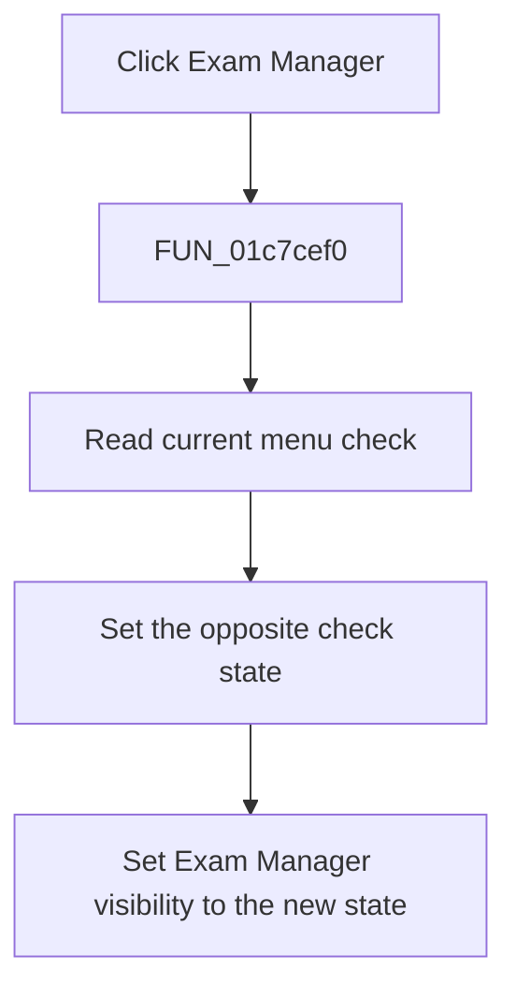

# &Exam Manager

> Analysis status: Complete. The handler state change and VCL setters establish the visibility toggle.

## Control

| Property | Recovered value |
| --- | --- |
| Form | SchematicEditor |
| Component path | SchematicEditor.MainMenu.View.mnFaultManager |
| Control class | TMenuItem |
| Caption | &Exam Manager |
| Hint | Not present in the recovered resource. |
| Text | Not present in the recovered resource. |
| Handler name | mnFaultManagerClick |
| Handler address | 01c7cef0 |
| Graph node | `resource:dfm:SchematicEditor/SchematicEditor.MainMenu.View.mnFaultManager` |
| Handler node | `function:01c7cef0` |
| Graph layer | UI |

## What happens when clicked

`FUN_01c7cef0` reads the checked state of the Exam Manager menu item and passes the opposite value to `TMenuItem.SetChecked`. It then passes the new checked value to the VCL visibility setter for the form field at offset `0xA60`. Thus, one click shows the Exam Manager pane or window, and the next click hides it. Both VCL setters do nothing when the requested value already matches the control state.

## Click flow

## Handler evidence

- Source: [DecompiledSources/Tina16/functions/0000000001C7CEF0__FUN_01c7cef0.c](../../../DecompiledSources/Tina16/functions/0000000001C7CEF0__FUN_01c7cef0.c)
- Recovered role: Toggles the checked state and visibility of the Exam Manager view.
- Current graph summary: Handles 1 Delphi UI event: SchematicEditor.MainMenu.View.mnFaultManager.OnClick.
- Current graph behavior: Inverts the Exam Manager menu check and applies the new value to the paired view's Visible property.
- Current graph evidence: The DFM binds this menu item to `FUN_01c7cef0`. The body passes the inverse of field `0xA58` checked state to `FUN_007e2d20`, then passes its new checked byte to `FUN_0064dbe0` for field `0xA60`. Recovered VCL bodies identify these calls as checked-state and visibility setters.
- Complexity: moderate
- Distinct outgoing calls: 2

## Direct calls

- `function:0064dbe0` — FUN_0064dbe0
- `function:007e2d20` — FUN_007e2d20

## Resource evidence

- Kind: Not present in the recovered resource.
- Modal result: Not present in the recovered resource.
- Checked state: Not present in the recovered resource.
- List items: Not present in the recovered resource.
- Image reference: Not present in the recovered resource.
- Extracted glyph: None.

## Nearby label candidates

Nearby labels are layout candidates only. They are not proof of behavior.

- No same-parent label candidate is available.

## Analysis limits

- The recovered field at offset `0xA60` has no Delphi name. Its pairing with `mnFaultManager`, its visibility setter, and the `Exam Manager` caption establish its UI role.

