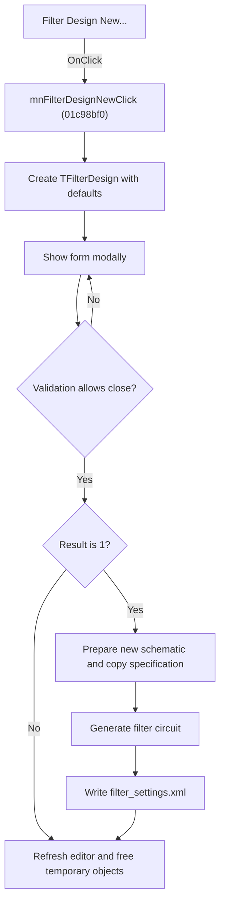

# Filter Design New...

> Analysis status: Source, graph, dialog, and generator evidence reviewed.

## Control

| Property | Recovered value |
| --- | --- |
| Form | SchematicEditor |
| Component path | SchematicEditor.MainMenu.mnTools.mnFilterDesignNew |
| Control class | TMenuItem |
| Caption | Filter Design New... |
| Hint | Not present in the recovered resource. |
| Text | Not present in the recovered resource. |
| Handler name | mnFilterDesignNewClick |
| Handler address | 01c98bf0 |
| Graph node | `resource:dfm:SchematicEditor/SchematicEditor.MainMenu.mnTools.mnFilterDesignNew` |
| Handler node | `function:01c98bf0` |
| Graph layer | UI |

## What happens when clicked

The command opens a new simplified Filter Design workflow. It creates `TFilterDesign` with a new default specification and shows the form modally. If numeric editor validation rejects a close, the dialog shows the editor error and remains open.

If the modal result is not `1`, the handler skips new-schematic creation, filter generation, and settings output. It still refreshes the Schematic Editor client and frees temporary objects. For result `1`, it copies the accepted controls into the filter specification, prepares a new schematic document, initializes the filter generator, and builds the filter circuit against the current circuit context. It then writes the accepted simplified controls to `filter_settings.xml` in the settings directory and refreshes the editor.

The generator can show recovered errors for a missing template, invalid limits, synthesis failure, or an order above `20`. The outer handler does not inspect a generator success value. After the generator returns, it continues to the settings-file write and refresh path.

## Click flow

## Handler evidence

- Source: [DecompiledSources/Tina16/functions/0000000001C98BF0__FUN_01c98bf0.c](../../../DecompiledSources/Tina16/functions/0000000001C98BF0__FUN_01c98bf0.c)
- Recovered role: Runs the simplified new-filter workflow and creates a circuit after acceptance.
- Current graph summary: Shows `TFilterDesign` modally, generates a new filter circuit for result `1`, writes `filter_settings.xml`, and refreshes the Schematic Editor.
- Current graph behavior: Cancel skips creation, generation, and settings output. Generator errors do not stop the outer settings and refresh path after the generator returns.
- Current graph evidence: `FUN_01c98bf0` constructs the class whose DFM is `TFilterDesign`, tests modal result `1`, calls `FUN_01c77470` to prepare the Schematic Editor, initializes and runs the generator through `FUN_0123b660` through `FUN_0123bc40`, and calls annotated `FUN_019d45b0` with the literal `filter_settings.xml`. The same handler is traced end to end from the reviewed Analog Filter Design Simplified Interface command.
- Complexity: complex
- Distinct outgoing calls: 13

## Direct calls

- `function:00410f20` — Nil-safe Delphi object destruction helper
- `function:00414480` — Delphi UnicodeString clear and finalization helper
- `function:00416ba0` — FUN_00416ba0
- `function:00416cd0` — FUN_00416cd0
- `function:0064e770` — FUN_0064e770
- `function:007fc180` — FUN_007fc180
- `function:0123b660` — FUN_0123b660
- `function:0123b940` — FUN_0123b940
- `function:0123ba50` — FUN_0123ba50
- `function:0123bc40` — FUN_0123bc40
- `function:019a4600` — FUN_019a4600
- `function:019d45b0` — FUN_019d45b0
- `function:01c77470` — FUN_01c77470

## Resource evidence

- Kind: Not present in the recovered resource.
- Modal result: Not present in the recovered resource.
- Checked state: Not present in the recovered resource.
- List items: Not present in the recovered resource.
- Image reference: Not present in the recovered resource.
- Extracted glyph: None.

## Nearby label candidates

Nearby labels are layout candidates only. They are not proof of behavior.

- No same-parent label candidate is available.

## Analysis limits

- The exact owner-visible document title after successful generation is not present in the traced source.
- The generator reports errors through dialogs, but the outer handler has no returned-success test or rollback branch.

