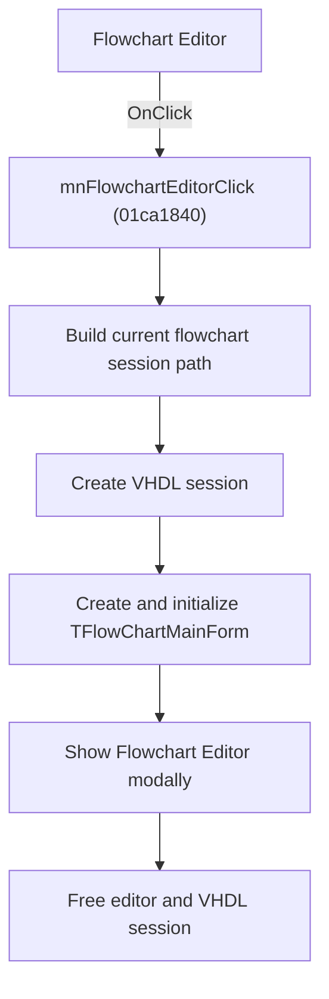

# Flowchart Editor

> Analysis status: Source, graph, session, and form evidence reviewed.

## Control

| Property | Recovered value |
| --- | --- |
| Form | SchematicEditor |
| Component path | SchematicEditor.MainMenu.mnTools.mnFlowchartEditor |
| Control class | TMenuItem |
| Caption | Flowchart Editor |
| Hint | Not present in the recovered resource. |
| Text | Not present in the recovered resource. |
| Handler name | mnFlowchartEditorClick |
| Handler address | 01ca1840 |
| Graph node | `resource:dfm:SchematicEditor/SchematicEditor.MainMenu.mnTools.mnFlowchartEditor` |
| Handler node | `function:01ca1840` |
| Graph layer | UI |

## What happens when clicked

The command builds the current flowchart session path from the shared project context and stores it in the Schematic Editor. It opens a new VHDL session for that path and stores the session handle. It then creates `TFlowChartMainForm`, initializes the form with the session, creates the flowchart simulator state with the recovered default device `PIC16F73`, and shows the editor modally.

When the modal editor returns, the handler frees the VHDL session and the temporary Flowchart Editor form. If session creation returns a null handle, the session helper constructs and raises the recovered error object. The outer handler has no separate fallback session.

## Click flow

## Handler evidence

- Source: [DecompiledSources/Tina16/functions/0000000001CA1840__FUN_01ca1840.c](../../../DecompiledSources/Tina16/functions/0000000001CA1840__FUN_01ca1840.c)
- Recovered role: Opens the Flowchart Editor for a temporary VHDL session and releases the session on return.
- Current graph summary: Builds the flowchart path, opens the VHDL session, initializes `TFlowChartMainForm`, shows it modally, and frees the session.
- Current graph behavior: The editor receives a recovered default device of `PIC16F73`. Session creation failure is reported by the session helper; the outer command has no alternative session path.
- Current graph evidence: `FUN_015fcb30` builds the path, `FUN_015fcc20` invokes `_NewVHDLSession`, and `FUN_01051910` stores the session in `TFlowChartMainForm`, sets the caption, initializes flowchart controls, assigns `PIC16F73`, and calls `_CreateSimulatorObject`. `FUN_015fcd60` calls `_FreeVHDLSession` after the modal form returns.
- Complexity: complex
- Distinct outgoing calls: 10

## Direct calls

- `function:00410f20` — Nil-safe Delphi object destruction helper
- `function:00414480` — Delphi UnicodeString clear and finalization helper
- `function:00414ad0` — Delphi UnicodeString assignment helper
- `function:00442620` — FUN_00442620
- `function:007fc180` — FUN_007fc180
- `function:01051910` — FUN_01051910
- `function:015fcb30` — FUN_015fcb30
- `function:015fcbd0` — FUN_015fcbd0
- `function:015fcc20` — FUN_015fcc20
- `function:015fcd60` — FUN_015fcd60

## Resource evidence

- Kind: Not present in the recovered resource.
- Modal result: Not present in the recovered resource.
- Checked state: Not present in the recovered resource.
- List items: Not present in the recovered resource.
- Image reference: Not present in the recovered resource.
- Extracted glyph: None.

## Nearby label candidates

Nearby labels are layout candidates only. They are not proof of behavior.

- No same-parent label candidate is available.

## Analysis limits

- The recovered path builder does not expose a user-facing project name in this handler.
- Save operations inside `TFlowChartMainForm` are separate event paths. This outer handler only owns session setup and cleanup.

