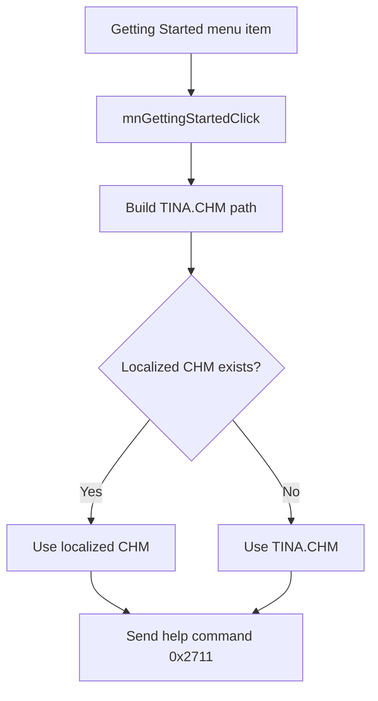

# &Getting Started

> Analysis status: Reviewed with recovered handler and localized-help evidence.

## Control

| Property | Recovered value |
| --- | --- |
| Component path | `SchematicEditor.MainMenu.Help.mnGettingStarted` |
| Control class | `TMenuItem` |
| Handler | `mnGettingStartedClick` at `01c8e7d0` |

## What happens when clicked

The command builds the path for `TINA.CHM`. It asks the language-path helper for a language-specific file. The helper uses that file when it exists and otherwise keeps the original file. The handler then sends help command `0x2711` and the selected CHM path to the application help service.

## Click flow

## Evidence

- [Handler source](../../../DecompiledSources/Tina16/functions/0000000001C8E7D0__FUN_01c8e7d0.c) builds `TINA.CHM` and dispatches command `0x2711`.
- [Language-path helper](../../../DecompiledSources/Tina16/functions/0000000001B1DEF0__FUN_01b1def0.c) tests the localized path and falls back to the original path.

## Analysis limits

- The recovered code does not expose the displayed help-topic title.
