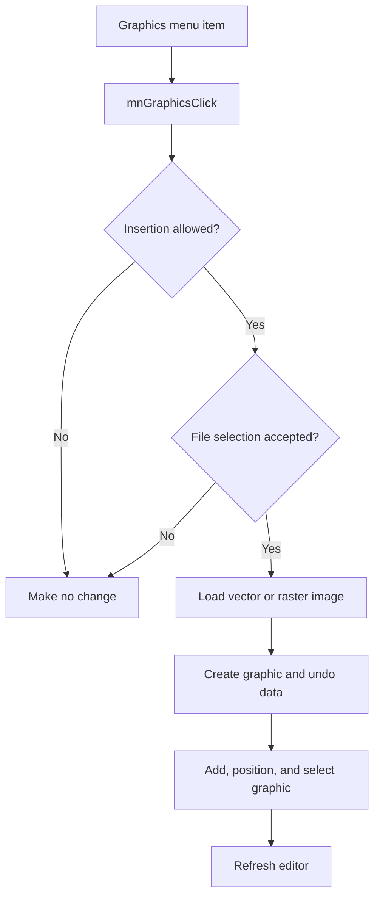

# &Graphics...

> Analysis status: Reviewed with recovered file-format, undo, and placement evidence.

## Control

| Property | Recovered value |
| --- | --- |
| Component path | `SchematicEditor.MainMenu.Insert.mnGraphics` |
| Control class | `TMenuItem` |
| Handler | `mnGraphicsClick` at `01c83fb0` |

## What happens when clicked

The command stops when the editor blocks insertion or when the file selection is not accepted. It loads the selected vector or raster image according to its extension, creates a schematic graphic, and scales the image data for the current display density. It then records undo data, adds the graphic to the schematic, clears the old selection, positions and selects the new graphic at the current insertion coordinates, and refreshes the editor.

## Click flow

## Evidence

- [Handler source](../../../DecompiledSources/Tina16/functions/0000000001C83FB0__FUN_01c83fb0.c) contains the file-extension branches and the complete insertion path.
- [Graphic constructor](../../../DecompiledSources/Tina16/functions/00000000010B7590__FUN_010b7590.c) initializes image type, scale, size, and graphic state.
- [Selection helper](../../../DecompiledSources/Tina16/functions/0000000001993F30__FUN_01993f30.c) applies the selected state to the inserted object.

## Analysis limits

- The recovered file-dialog object has no Delphi field name.
