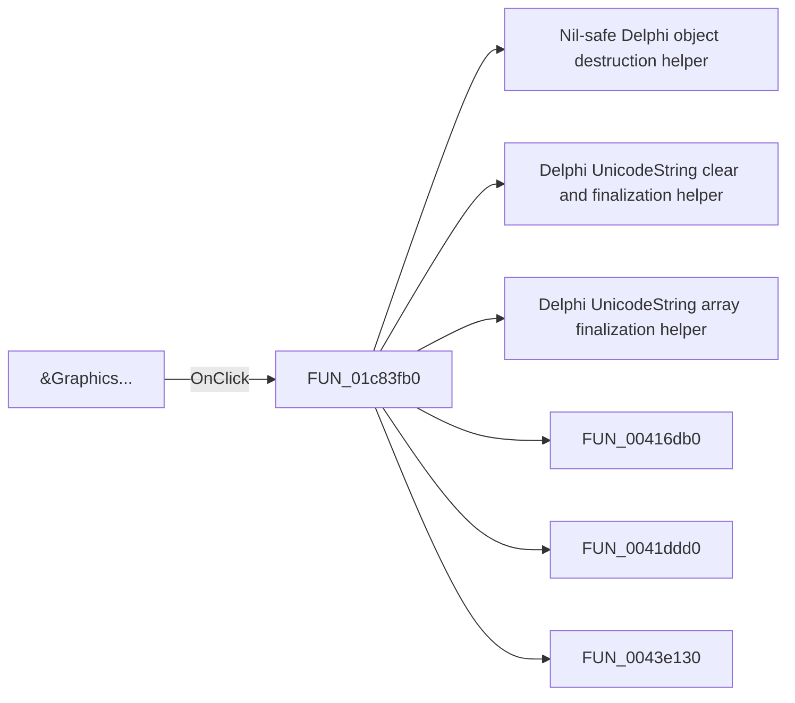

# &Graphics...

> Analysis status: Pending individual source review.

## Control

| Property | Recovered value |
| --- | --- |
| Form | SchematicEditor |
| Component path | SchematicEditor.MainMenu.Insert.mnGraphics |
| Control class | TMenuItem |
| Caption | &Graphics... |
| Hint | Not present in the recovered resource. |
| Text | Not present in the recovered resource. |
| Handler name | mnGraphicsClick |
| Handler address | 01c83fb0 |
| Graph node | `resource:dfm:SchematicEditor/SchematicEditor.MainMenu.Insert.mnGraphics` |
| Handler node | `function:01c83fb0` |
| Graph layer | UI |

## What happens when clicked

Pending individual analysis. An agent must read the recovered handler source and its relevant callees before it replaces this text.

## Click flow

## Handler evidence

- Source: [DecompiledSources/Tina16/functions/0000000001C83FB0__FUN_01c83fb0.c](../../../DecompiledSources/Tina16/functions/0000000001C83FB0__FUN_01c83fb0.c)
- Recovered role: Not present in the recovered resource.
- Current graph summary: Handles 1 Delphi UI event: SchematicEditor.MainMenu.Insert.mnGraphics.OnClick.
- Current graph behavior: Not present in the recovered resource.
- Current graph evidence: Not present in the recovered resource.
- Complexity: complex
- Distinct outgoing calls: 28

## Direct calls

- `function:00410f20` — Nil-safe Delphi object destruction helper
- `function:00414480` — Delphi UnicodeString clear and finalization helper
- `function:00414560` — Delphi UnicodeString array finalization helper
- `function:00416db0` — FUN_00416db0
- `function:0041ddd0` — FUN_0041ddd0
- `function:0043e130` — FUN_0043e130
- `function:00441a10` — FUN_00441a10
- `function:00605cc0` — FUN_00605cc0
- `function:006060c0` — FUN_006060c0
- `function:006061a0` — FUN_006061a0
- `function:006061d0` — FUN_006061d0
- `function:00608c80` — FUN_00608c80
- `function:00724270` — FUN_00724270
- `function:00a09e20` — FUN_00a09e20
- `function:00a39860` — FUN_00a39860
- `function:00c32af0` — FUN_00c32af0
- `function:010b6d50` — FUN_010b6d50
- `function:010b7590` — FUN_010b7590
- `function:017baeb0` — FUN_017baeb0
- `function:017baf50` — FUN_017baf50
- `function:0198d430` — FUN_0198d430
- `function:01993f30` — FUN_01993f30
- `function:01994230` — FUN_01994230
- `function:0199e310` — FUN_0199e310
- `function:01a9a4e0` — FUN_01a9a4e0
- `function:01b23050` — FUN_01b23050
- `function:01c6d670` — FUN_01c6d670
- `function:01c8cee0` — FUN_01c8cee0

## Resource evidence

- Kind: Not present in the recovered resource.
- Modal result: Not present in the recovered resource.
- Checked state: Not present in the recovered resource.
- List items: Not present in the recovered resource.
- Image reference: Not present in the recovered resource.
- Extracted glyph: None.

## Nearby label candidates

Nearby labels are layout candidates only. They are not proof of behavior.

- No same-parent label candidate is available.

## Analysis limits

- Do not infer behavior from the control class, caption, hint, glyph, or nearby label alone.
- Do not replace the pending status until the handler source and relevant call path provide enough evidence.
